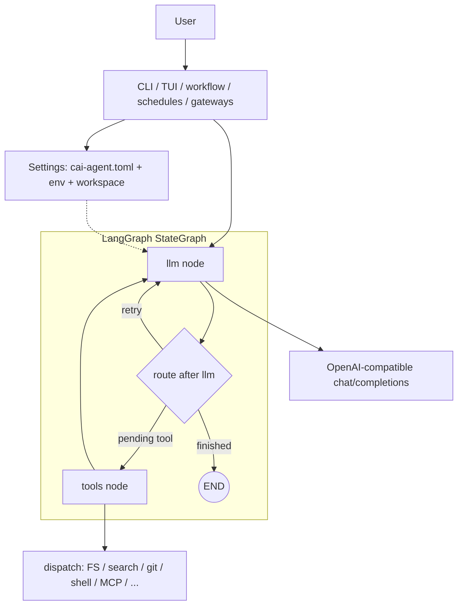

# CAI Agent

Terminal-first coding agent on **LangGraph**: natural language over a workspace (tree, list dir, glob, text search, read/write files, sandboxed commands) against any **OpenAI-compatible** `POST /v1/chat/completions` (defaults work well with [LM Studio](https://lmstudio.ai/)). Optional **Textual** TUI.

> **中文完整说明**：[README.zh-CN.md](README.zh-CN.md)

## Documentation map

- **Quick start**: Requirements → Install → Five-minute path.
- **Docs entrypoint**: [`docs/README.md`](docs/README.md).
- **Core product docs**: `PRODUCT_PLAN`, `ROADMAP_EXECUTION`, `PRODUCT_GAP_ANALYSIS`, `PARITY_MATRIX`.
- **Configuration**: TOML keys, env overrides, sample config.
- **CLI & TUI**: Command reference and slash commands.
- **Changelog**: `CHANGELOG.md` (English default); `CHANGELOG.zh-CN.md` (Chinese).

### CLI highlights

| Goal | Example |
|------|---------|
| Plan only (no tools) | `cai-agent plan "Add auth; outline steps and risks"` |
| Plan JSON (stable schema) | `cai-agent plan "..." --json` → `plan_schema_version`, `ok`, `generated_at`, `task`, `usage` (errors: `config_not_found` / `goal_empty` / `llm_error`) |
| Session stats JSON | `cai-agent stats --json` → `stats_schema_version`, `run_events_total`, `session_summaries`, etc. |
| Session insights | `cai-agent insights --json --days 7` → cross-session trends (`models_top`, `tools_top`, `top_error_sessions`) |
| Session recall search | `cai-agent recall --query "auth timeout" --json` (optional `--sort recent|density|combined`; `--use-index` + `--index-path` for `.cai-recall-index.json`) |
| Recall index (incremental) | `cai-agent recall-index build` then `cai-agent recall-index refresh` (skip unchanged mtime; `refresh --prune` drops missing/out-of-window paths); `recall-index doctor [--fix] [--json]` checks index vs disk (exit 0 healthy / 2 issues); `python3 scripts/perf_recall_bench.py --sessions 10 50 200` writes a Markdown timing report under `docs/qa/runs/` |
| Cross-session recall | `cai-agent recall --query "auth" --days 14 --json` → matched session snippets with file/time metadata |
| Scheduled automations | `cai-agent schedule add --every-minutes 60 --goal "Daily repo health summary"` (optional `--max-retries`, `--depends-on`; cyclic `depends_on` graphs are rejected with exit **2** / JSON `schedule_add_invalid`) then `cai-agent schedule list --json` (adds `depends_on_chain`, `dependency_blocked`, `dependents`) and `cai-agent schedule daemon --interval-sec 30 --max-cycles 20 --max-concurrent 1 --execute --json` (audit + `--jsonl-log` share the **S4-04** line schema in `docs/schema/SCHEDULE_AUDIT_JSONL.zh-CN.md`); **`cai-agent schedule stats --json --days 30`** rolls up per-task `success_rate` / latency stats from the audit log (`docs/schema/SCHEDULE_STATS_JSON.zh-CN.md`) |
| Memory nudge schedule template | `cai-agent schedule scaffold memory-nudge --json` (optional `--every-minutes`, `--output-file`, `--fail-on-severity`, `--add-task`) |
| Save plan to disk | `cai-agent plan "..." --write-plan ./PLAN.md` |
| Run with an existing plan | `cai-agent run --plan-file ./PLAN.md "Implement step 1"` |
| Machine-readable run | `cai-agent run --json "List open risks in the diff"` |
| Sessions | `cai-agent run --save-session .cai-session.json "..."` then `cai-agent continue .cai-session.json "..."` |
| Multi-step workflow | `cai-agent workflow workflow.json --json` (root `merge_strategy`, **`on_error`**: `fail_fast` / `continue_on_error`, optional **`budget_max_tokens`** + summary **`budget_*`**, optional root **`quality_gate`** + **`post_gate`** result; steps may set **`parallel_group`**) |
| Quality gate / CI | `cai-agent quality-gate --json` (optional `--report-dir DIR`; `[quality_gate]` `test_policy` / `lint_policy`: `skip` or `fail_if_missing`) |
| Security scan | `cai-agent security-scan --json` (`[security_scan]` `exclude_globs`, `rule_overrides`) |
| Memory | `cai-agent memory extract` → `memory/entries.jsonl` (stdout JSON **`memory_extract_v1`**); **`memory list --json`** → **`memory_list_v1`** with **`entries`**; **`memory search --json`** → **`memory_search_v1`**; instinct paths via **`memory instincts --json`** (**`memory_instincts_list_v1`**); **`memory export --json`** / **`export-entries --json`** → **`memory_instincts_export_v1`** / **`memory_entries_export_result_v1`** (optional; default stdout is still the output path); `memory prune`; **`memory health --json`** (Hermes parity: `health_score`, `grade`, `freshness` / `coverage` / `conflict_rate`, `--fail-on-grade`, `--max-conflict-compare-entries`); health nudges via `memory nudge --json` (`--write-file`, `--fail-on-severity`); historical trend via `memory nudge-report --json` (`schema_version=1.2`, `health_score`, `freshness`, `--freshness-days`, `severity_jumps`); **`memory user-model --json`** → **`memory_user_model_v1`** (`honcho_parity: behavior_extract`); **`memory user-model export`** → **`user_model_bundle_v1`** (archival bundle); one-step schedule preset via `schedule add-memory-nudge` |
| Memory state machine | `cai-agent memory state --json` → `active/stale/expired` distribution; `memory list --json` includes per-entry `state` / `state_reason`; `memory prune --drop-non-active` (optional `--state-stale-after-days`, `--state-min-active-confidence`) |
| Gateways | `cai-agent gateway telegram ...`; Discord / Slack / Teams MVPs: `gateway discord serve-polling`, `gateway slack serve-webhook`, `gateway teams bind|get|list|unbind|allow|health|manifest|serve-webhook`; platform summary: `gateway platforms list --json` |
| Runtime backends | `cai-agent runtime list --json`; `[runtime] backend = "docker"` supports container/image modes, volumes and limits; `[runtime] backend = "ssh"` supports key/known_hosts/timeout diagnostics and optional audit JSONL |
| Release gate matrix | `cai-agent release-ga --json --with-memory-state --memory-max-stale-ratio 0.5 --memory-max-expired-ratio 0.1` (+ existing `--with-doctor`, `--with-memory-nudge`) |
| Cost budget | `cai-agent cost budget --check` (session `total_tokens`; default cap `[cost] budget_max_tokens`; override `--max-tokens`) |
| Observability | `cai-agent observe --json` (stable `schema_version` and aggregates); text mode prints `run_events_total` |
| Ops dashboard | `cai-agent ops dashboard --format json|text|html` ( **`ops_dashboard_v1`** ); HTML supports **`--html-refresh-seconds`** ( **`meta refresh`** ); **`cai-agent ops serve`** exposes **`GET /v1/ops/dashboard`** and **`GET /v1/ops/dashboard.html`** (read-only HTTP sidecar; optional **`CAI_OPS_API_TOKEN`** ); see **`docs/OPS_DYNAMIC_WEB_API.md`** |
| Cross-tool export | `cai-agent export --target cursor`, `codex`, or `opencode` (`-w` workspace; manifest + README; see `docs/CROSS_HARNESS_COMPATIBILITY.md` and `docs/CROSS_HARNESS_COMPATIBILITY.zh-CN.md`) |
| Plugin surface | `cai-agent plugins --json` (`health_score` heuristic); **`--with-compat-matrix`** emits **`plugin_compat_matrix_v1`**; **`plugins --compat-check`** and `python scripts/gen_plugin_compat_snapshot.py --check` provide the CI gate/snapshot |

### Permissions (tools)

In `cai-agent.toml`, `[permissions]` supports `write_file`, `run_command`, and `fetch_url` with `allow`, `ask`, or `deny`. For `ask` in non-interactive mode, set **`CAI_AUTO_APPROVE=1`** or pass **`--auto-approve`** on `run` / `continue` / `command` / `agent` / `fix-build`.

### Configuration priority

1. Environment variables  
2. TOML (`CAI_CONFIG`, `--config`, or `cai-agent.toml` / `.cai-agent.toml` in cwd)  
3. Built-in defaults  

Do not commit real API keys.

### Further reading (repo docs)

| File | Topic |
|------|--------|
| [`docs/README.md`](docs/README.md) | Curated docs entrypoint |
| [`docs/PRODUCT_VISION_FUSION.zh-CN.md`](docs/PRODUCT_VISION_FUSION.zh-CN.md) | Product target: integrate Claude Code + Hermes Agent + ECC |
| [`docs/PRODUCT_PLAN.zh-CN.md`](docs/PRODUCT_PLAN.zh-CN.md) | Single execution plan |
| [`docs/ROADMAP_EXECUTION.zh-CN.md`](docs/ROADMAP_EXECUTION.zh-CN.md) | Current roadmap / todo list |
| [`docs/PRODUCT_GAP_ANALYSIS.zh-CN.md`](docs/PRODUCT_GAP_ANALYSIS.zh-CN.md) | Gaps and release gates |
| [`docs/PARITY_MATRIX.zh-CN.md`](docs/PARITY_MATRIX.zh-CN.md) | Release review matrix |
| [`docs/IMPLEMENTATION_STATUS.md`](docs/IMPLEMENTATION_STATUS.md) | Rolling one-page summary |
| [`docs/ISSUE_BACKLOG.md`](docs/ISSUE_BACKLOG.md) / [`docs/ISSUE_BACKLOG.zh-CN.md`](docs/ISSUE_BACKLOG.zh-CN.md) | Issue drafts and recently closed implementation tickets |
| [`docs/DEVELOPER_TODOS.zh-CN.md`](docs/DEVELOPER_TODOS.zh-CN.md) | Future developer queue, OOS items, and execution rules (Chinese-only) |
| [`docs/COMPLETED_TASKS_ARCHIVE.md`](docs/COMPLETED_TASKS_ARCHIVE.md) / [`docs/COMPLETED_TASKS_ARCHIVE.zh-CN.md`](docs/COMPLETED_TASKS_ARCHIVE.zh-CN.md) | Completed task archive |
| [`docs/TEST_TODOS.zh-CN.md`](docs/TEST_TODOS.zh-CN.md) | Current QA baseline and focused testing queue (Chinese-only) |
| [`docs/OPS_DYNAMIC_WEB_API.md`](docs/OPS_DYNAMIC_WEB_API.md) | Ops dashboard HTTP contract |
| [`docs/schema/README.md`](docs/schema/README.md) / [`docs/schema/README.zh-CN.md`](docs/schema/README.zh-CN.md) | JSON schema index |
| [`docs/archive/README.md`](docs/archive/README.md) / [`docs/archive/README.zh-CN.md`](docs/archive/README.zh-CN.md) | Historical documentation archive |

---

## Version requirements

- **Python**: **3.11+** (see `cai-agent/pyproject.toml` **`requires-python`**).
- **Upgrading from 0.5.x**: read **[`docs/MIGRATION_GUIDE.md`](docs/MIGRATION_GUIDE.md)** before relying on saved `jq`/CI parsers for `--json` output.

---

## Five-minute quick start

1. Install (editable):

```bash
cd cai-agent
pip install -e .
```

2. Create config and set the model:

```bash
cai-agent init
```

If you are upgrading instead of starting fresh, check repo-root `CHANGELOG.md` / `CHANGELOG.zh-CN.md` first, then run `cai-agent doctor` to confirm the current config and entry docs still line up.

For a **single file** that already lists **LM Studio, Ollama, vLLM, OpenRouter, Zhipu GLM, and a self-hosted OpenAI-compatible gateway** as separate `[[models.profile]]` entries, run:

```bash
cai-agent init --preset starter
```

Edit `cai-agent.toml` `[llm]` and/or switch `[models].active`, or use environment variables. You can also add one-off profiles with `cai-agent models add --preset vllm --id my-vllm --model <served-model-id>`, `models add --preset gateway --id corp --base-url http://internal:8080/v1`, or **`models add --preset zhipu --id my-glm`** (expects env **`ZAI_API_KEY`**; see [Zhipu OpenAI-compatible docs](https://docs.bigmodel.cn/cn/guide/develop/openai/introduction)).

3. Health check and one task:

```bash
cai-agent doctor
cai-agent run "Summarize this repository layout and name the main modules"
```

4. Optional TUI:

```bash
cai-agent ui -w "$PWD"
```

## Common workflow examples

### 1) Plan only

```bash
cai-agent plan "Add login auth; outline steps and risks"
```

### 2) One-shot run with JSON

```bash
cai-agent run --json "List unfinished TODOs in this repo"
```

### 3) Sessions

```bash
cai-agent run --save-session .cai-session.json "Finish step-one analysis"
cai-agent continue .cai-session.json "Propose an implementation plan"
cai-agent sessions --details
```

### 4) Multi-step `workflow`

```json
{
  "on_error": "continue_on_error",
  "budget_max_tokens": 12000,
  "quality_gate": {
    "lint": true,
    "security_scan": true,
    "report_dir": ".cai/qg-report"
  },
  "steps": [
    {"name": "scan", "goal": "Map the repo and key modules"},
    {"name": "plan", "goal": "Produce a refactor plan with risks"}
  ]
}
```

```bash
cai-agent workflow workflow.json --json
```

The workflow JSON root also accepts `quality_gate: true | {...}`. When the workflow itself finishes successfully, CAI runs one post `quality-gate`, returns a `quality_gate` summary plus optional `post_gate` (`quality_gate_result_v1`), and fails the workflow if that gate fails.

## Product positioning

CAI Agent is positioned as a **single integrated runtime** that combines three upstream product lines:

- [`anthropics/claude-code`](https://github.com/anthropics/claude-code): terminal-agent UX baseline
- [`NousResearch/hermes-agent`](https://github.com/NousResearch/hermes-agent): profiles, dashboards, gateways, API/server, backends, memory providers
- [`affaan-m/everything-claude-code`](https://github.com/affaan-m/everything-claude-code): rules, skills, hooks, model routing, cross-harness export, governance patterns

The goal is **integration**, not a wrapper suite of multiple CLIs and not a clone of the upstream TS/Bun/Ink internals. See [`docs/PRODUCT_VISION_FUSION.zh-CN.md`](docs/PRODUCT_VISION_FUSION.zh-CN.md), [`docs/PRODUCT_GAP_ANALYSIS.zh-CN.md`](docs/PRODUCT_GAP_ANALYSIS.zh-CN.md), and [`docs/ROADMAP_EXECUTION.zh-CN.md`](docs/ROADMAP_EXECUTION.zh-CN.md).

## Architecture (high level)

The run loop lives in **`cai_agent/graph.py`**: a **LangGraph** `StateGraph` with an **llm** node (one JSON object per turn: `finish` or `tool`) and a **tools** node (`dispatch` → workspace tools + optional MCP), wired `llm → route → (END | tools | llm)` and `tools → llm` until finished or `max_iterations`. CLI, TUI, `plan`, `workflow`, schedules, and gateways orchestrate this graph (and related commands) on top of shared **Settings** (TOML + env + workspace).



Plain-text layout (works when Mermaid is not rendered):

```text
  User → CLI / TUI / workflow / … (+ Settings: TOML + env + workspace)

  LangGraph StateGraph (simplified):
    START → llm → route:
                ├─► END                         (finished)
                ├─► tools → llm → route → …    (one tool round)
                └─► llm → route → …           (retry JSON / next iteration)

  llm  →  OpenAI-compatible chat/completions
  tools → dispatch (FS / search / git / shell / MCP / …)
```

Longer narrative: [`docs/ARCHITECTURE.zh-CN.md`](docs/ARCHITECTURE.zh-CN.md).

## Copilot provider

Built-in **`llm.provider = "copilot"`** for OpenAI-compatible proxies in front of Copilot-style backends.

- **Precedence (copilot mode)**: `COPILOT_*` env > `[copilot]` > `[llm]`.
- **Common vars**: `COPILOT_BASE_URL`, `COPILOT_MODEL`, `COPILOT_API_KEY`.
- **Model listing**: `cai-agent models`; override per run with `--model`.

GitHub does not ship a stable public generic `chat/completions` API; engineering setups usually use a compatible proxy.

## MCP Bridge (optional)

Tools: `mcp_list_tools`, `mcp_call_tool`.

```toml
[mcp]
base_url = "http://localhost:8787"
api_key = "optional-token"
timeout_sec = 20

[agent]
mcp_enabled = true
```

Protocol (current):

- `GET {base_url}/tools` → JSON tool list or string array.
- `POST {base_url}/tools/{name}` with body `{"args":{...}}`.

## Changelog

See **`CHANGELOG.md`** (English). Chinese: **`CHANGELOG.zh-CN.md`**.

## Rules / skills layout

- `rules/common/`, `rules/python/`: engineering and Python conventions.
- `skills/`: reusable workflows.
- `commands/`, `agents/`, `hooks/`: command templates, sub-agents, hook metadata (`hooks.json`).

`cai-agent command` / `cai-agent agent` may auto-inject matching `skills/` text.

---

## Requirements

- Python **3.11+**
- OpenAI-compatible Chat Completions endpoint

## Install

```bash
cd cai-agent
pip install -e .
```

CLI: `cai-agent` (`cai-agent --version`).

## macOS / Linux snippets

```bash
cd /path/to/Cai_Agent/cai-agent
python3 -m pip install -e .
cai-agent init
```

```bash
export LM_PROVIDER=copilot
export COPILOT_BASE_URL=http://localhost:4141/v1
export COPILOT_MODEL=gpt-4o-mini
export COPILOT_API_KEY=your-token
```

```bash
cai-agent doctor
cai-agent models
cai-agent run --workspace "$PWD" "Summarize repo layout"
cai-agent ui -w "$PWD"
cai-agent mcp-check --verbose
cai-agent fix-build "Fix failing tests"
cai-agent security-scan --json
cai-agent security-scan --json --exclude-glob "**/*.md"
cai-agent plugins
cai-agent quality-gate
cai-agent quality-gate --lint --security-scan
cai-agent quality-gate --no-test
cai-agent memory extract --limit 5
cai-agent memory list --json
cai-agent cost budget --check --max-tokens 60000
cai-agent export --target cursor
cai-agent observe --json
```

## Windows snippets

```powershell
cd .\cai-agent
py -m pip install -e .
cai-agent init
set LM_PROVIDER=copilot
set COPILOT_BASE_URL=http://localhost:4141/v1
set COPILOT_MODEL=gpt-4o-mini
set COPILOT_API_KEY=your-token
```

## Configuration file

1. Run **`cai-agent init`** (writes `cai-agent.toml` with a minimal `[llm]` aimed at local LM Studio). Use **`cai-agent init --preset starter`** when you want multiple ready-made profiles (local backends + OpenRouter + **Zhipu GLM** + a placeholder self-hosted gateway); set `OPENROUTER_API_KEY` / `OPENAI_API_KEY` / **`ZAI_API_KEY`** as needed and `cai-agent models use <id>` to switch. For CI, **`cai-agent init --json`** prints **`init_cli_v1`** on stdout (see `docs/schema/README.zh-CN.md`).
2. Place `cai-agent.toml` in the working directory, or use **`CAI_CONFIG`** / **`--config`**.
3. **Priority**: environment variables > TOML > defaults. Do not commit real API keys.

### `[llm]`

| Key | Meaning |
|-----|---------|
| `base_url` | API base; `/v1` is appended when missing **except** for Zhipu hosts under `open.bigmodel.cn/.../api/paas/...` (chat lives at `.../chat/completions` without an extra `/v1`). |
| `model` | Model id |
| `api_key` | Bearer token |
| `provider` | `openai_compatible` or `copilot` |
| `http_trust_env` | When `true`, httpx reads `HTTP_PROXY` / `HTTPS_PROXY`. **Loopback** targets (`localhost`, `127.*`, `::1`) still use **direct connections** for LLM chat, `/models` / profile ping, and MCP so local LM Studio is not sent through a corporate proxy (which often yields HTTP **503**). |
| `temperature` | Sampling temperature (clamped) |
| `timeout_sec` | HTTP timeout for chat completions |
| `context_window` | Model context window in tokens; **display-only** (drives the TUI context bar denominator, never sent to the server). Default `8192`. Override via env `CAI_CONTEXT_WINDOW` or per-profile `[[models.profile]].context_window` (preferred). Common values: LM Studio/Qwen/Gemma local 32768, gpt-4o 128000, claude-sonnet 200000. |

### Zhipu AI (GLM, OpenAI-compatible)

Use provider **`openai_compatible`** with:

- **`base_url`**: `https://open.bigmodel.cn/api/paas/v4` (no trailing `/v1`; the runtime normalizes this correctly).
- **`model`**: e.g. `glm-5.1` (see [model docs](https://docs.bigmodel.cn/cn/guide/models/text/glm-5.1)).
- **API key**: set env **`ZAI_API_KEY`** and reference it from a profile with `api_key_env = "ZAI_API_KEY"` (recommended), or use `cai-agent models add --preset zhipu --id <id> --set-active`.

[Zhipu OpenAI-compatible guide](https://docs.bigmodel.cn/cn/guide/develop/openai/introduction) · [LangChain + Zhipu example](https://docs.bigmodel.cn/cn/guide/develop/langchain/introduction) (this repo talks to the HTTP API directly; LangChain is optional elsewhere).

### `[agent]`

| Key | Meaning |
|-----|---------|
| `workspace` | Optional workspace root (else cwd / `CAI_WORKSPACE`) |
| `max_iterations` | Max LLM↔tool rounds |
| `command_timeout_sec` | `run_command` timeout |
| `mock` | Skip real LLM when `true` |
| `project_context` | Attach CAI.md-style context when `true` |
| `git_context` | Attach read-only git summary when `true` |
| `mcp_enabled` | Enable MCP tools when `true` |

### Copilot example

```toml
[llm]
provider = "copilot"

[copilot]
base_url = "http://localhost:4141/v1"
model = "gpt-4o-mini"
api_key = "your-copilot-proxy-token"
```

## Environment variables

| Variable | Role |
|----------|------|
| `CAI_CONFIG` | Path to TOML config |
| `CAI_WORKSPACE` | Workspace root |
| `CAI_CONTEXT_WINDOW` | Override the TUI context-bar denominator (tokens) |
| `LM_BASE_URL` / `LM_MODEL` / `LM_API_KEY` | LLM endpoint |
| `LM_PROVIDER` | `openai_compatible` or `copilot` |
| `ZAI_API_KEY` | Zhipu / BigModel API key (used when a profile sets `api_key_env = "ZAI_API_KEY"`) |
| `COPILOT_*` | Copilot-mode overrides |
| `MCP_ENABLED` | `1` enables MCP tools |
| `MCP_BASE_URL` / `MCP_API_KEY` / `MCP_TIMEOUT` | MCP bridge |

## Sample `cai-agent.toml`

```toml
[llm]
provider = "openai_compatible"
base_url = "http://localhost:1234/v1"
model = "google/gemma-4-31b"
api_key = "lm-studio"
temperature = 0.2
timeout_sec = 120
http_trust_env = false
context_window = 32768  # TUI progress-bar denominator; display-only

[agent]
workspace = "."
max_iterations = 16
command_timeout_sec = 120
mock = false
project_context = true
git_context = true
mcp_enabled = false

[mcp]
base_url = "http://localhost:8787"
api_key = ""
timeout_sec = 20

[copilot]
base_url = "http://localhost:4141/v1"
model = "gpt-4o-mini"
api_key = ""
```

### Production tips

- Prefer `temperature` **0.0–0.2** for stability.
- Raise `max_iterations` for long tasks; pair with `plan` first.
- Increase `timeout_sec` if first-token latency is high.
- Keep `mcp_enabled=false` until you explicitly need MCP.

## Command reference (short)

### `cai-agent doctor`

Validates config, workspace, provider/model.

### `cai-agent run`

Goal → tools → final answer.

### `cai-agent plan`

Read-only plan text; use `--write-plan path.md` to persist. **`plan --json`** adds stable keys: `plan_schema_version`, `generated_at`, `task`, `usage`, plus `goal` / `plan` / `workspace` / `model`.

### `cai-agent run --json`

Machine-readable payload: `answer`, `iteration`, `finished`, `provider`, `model`, `elapsed_ms`, tool stats, tokens, `run_schema_version`, `events`, etc.

## End-to-end demo (analyze → plan → workflow → sessions)

**A** Analyze:

```bash
cai-agent run --save-session .cai-session.json "Analyze core modules and risks"
```

**B** Continue for a plan:

```bash
cai-agent continue .cai-session.json "From the analysis, output a three-phase plan"
```

**C** Workflow JSON then:

```bash
cai-agent workflow workflow.json --json
```

If `workflow.json` enables root `quality_gate`, the final JSON also includes `quality_gate` / `post_gate` fields so CI can treat the workflow as a single gated unit.

**D** Inspect sessions:

```bash
cai-agent sessions --details
```

Workflow may write instinct snapshots under `memory/` when enabled.

## MCP end-to-end

Enable MCP in TOML, then:

```bash
cai-agent mcp-check --verbose
cai-agent mcp-check --force
cai-agent mcp-check --tool ping --args "{}"
```

In TUI: `/mcp`, `/mcp refresh`, `/mcp call <name> <json_args>`.

## TUI quick path

```bash
cai-agent ui -w "$PWD"
```

Suggested order: `/status` → **`Ctrl+M` or `/models`** (model panel: **Enter** on a row switches the **current TUI session**; **`t`** pings; **`a`/`e`/`d`** manage profiles and write TOML) → optionally `/use-model <profile_id>` for a quick switch → type a task → `/save` → `/load latest`.

To **persist** the default profile for the next CLI/TUI launch, run **`cai-agent models use <profile_id>`** (or edit `[models].active` in `cai-agent.toml`). **`/use-model`** and **Enter** in the panel only adjust the in-memory runtime unless a sub-action (e.g. add with “set active”) writes the file.

### Context usage bar

Above the input you'll see a one-line progress bar:

```
ctx ███░░░░░░░░░░░░░░░░░ ~512 / 32,768 (1.6%) · 估算
```

- The number on the left is the **actual `prompt_tokens`** of the last request the model saw (what's currently in the context window).
- The denominator is `Settings.context_window` — set it per-profile (`[[models.profile]].context_window`), via `[llm].context_window`, or with the env var `CAI_CONTEXT_WINDOW`. Default is `8192` (intentionally conservative; set it to your model's real window for accurate percentages). The welcome banner and `/status` print `context_window` plus `context_window_source` (`profile` / `llm` / `env` / `default`) so you can tell at a glance whether the TOML you expect was actually loaded (e.g. wrong `-w` cwd → `default` and 8k).
- Color thresholds: **green < 70%**, **yellow 70–89%**, **red ≥ 90%** — when it goes red, consider `/clear` or starting a new session to avoid truncation.
- The `~` prefix and "估算" tag indicate an estimate before the authoritative server count arrives: **CJK-heavy text uses ~1.5 chars/token**, ASCII uses ~4 chars/token (better than a flat `chars/4` for Chinese). After you press **Enter**, the bar re-estimates immediately with the new user message (still `~` until the response returns).
- Switching model (`/use-model`), `/clear`, or `/load` resets the bar to estimate mode until the next response.

## Workflow JSON schema

Root: `{"steps":[...]}`. Each step:

- `name` (optional)
- `goal` (required)
- `workspace` (optional)
- `model` (optional)
- `role` (optional): `default`, `explorer`, `reviewer`, `security`

Optional root `merge_strategy`: `require_manual`, `last_wins`, `role_priority`.

## CI integration

```bash
cai-agent run --json "Review risks in this change" > cai-report.json
```

Use `error_count`, `tool_calls_count`, `elapsed_ms` as soft quality gates.

## Usage cheat sheet

```bash
cai-agent doctor
cai-agent models
cai-agent commands
cai-agent command plan "Generate a plan for current changes"
cai-agent agents
cai-agent agent code-reviewer "Review this change for risks"
cai-agent sessions
cai-agent sessions --details
cai-agent run --model gpt-4o-mini "Explain project layout"
cai-agent continue .cai-session.json "Continue last task"
cai-agent run --json "Machine-readable output"
cai-agent mcp-check --force --verbose
cai-agent ui -w "$PWD"
cai-agent workflow path/to/workflow.json --json
```

**TUI slash commands**: type `/` in the chat input to open a selectable command menu; use arrow keys / Enter or Tab to accept. Native commands include `/help`, `/status`, `/models` (same as **Ctrl+M** model panel), `/models refresh`, `/mcp`, `/mcp refresh`, `/mcp call …`, `/mcp-presets`, `/save`, `/load`, `/sessions`, `/tasks`, `/use-model`, `/reload`, `/stop`, `/clear`, `/usage`, `/compress`, `/retry`, `/undo`, and `/personality`. Project command templates from `commands/*.md` (for example `/plan`, `/code-review`, `/verify`, `/fix-build`, `/security-scan`) are auto-discovered, completed, and executed through the same chat flow.

**TUI key bindings and copy/paste:**

- `Ctrl+M` chat LLM profiles · `Ctrl+C` stop current run · `Ctrl+Q` quit.
- **Copy** the chat area: drag-select with the mouse, then press `Ctrl+Shift+C` (Textual's `ALLOW_SELECT=True` is enabled explicitly so `RichLog` is selectable). A toast confirms how many characters were copied.
- **Select all** the chat area with `Ctrl+Shift+A`, then `Ctrl+Shift+C` to copy it wholesale; press `Esc` or click elsewhere to clear the selection.
- On **Windows Terminal** you can also hold **Shift** while drag-selecting to fall back to the terminal's native selection and press `Ctrl+C` to copy there.

**Config discovery order (highest to lowest, stops at the first hit):**

1. `--config <path>` (most explicit; emits a JSON error envelope when missing).
2. `CAI_CONFIG` environment variable.
3. Walk up the current working directory up to 12 levels looking for `cai-agent.toml` / `.cai-agent.toml`.
4. If still not found: walk from `CAI_WORKSPACE` and then from the CLI `-w/--workspace` hint. This covers "I `cd` somewhere else but pointed `-w` back to my project root".
5. Finally fall back to a **user-level global config** (so `cai-agent ui` from any directory still finds your settings):
   - Windows: `%APPDATA%\cai-agent\cai-agent.toml`
   - Linux / macOS: `$XDG_CONFIG_HOME/cai-agent/cai-agent.toml` (default `~/.config/cai-agent/cai-agent.toml`)
   - Compatibility fallbacks: `~/.cai-agent.toml`, `~/cai-agent.toml`

One-shot seeding:

```powershell
cai-agent init --global    # writes %APPDATA%\cai-agent\cai-agent.toml (or the XDG path)
```

Then edit the generated TOML — in particular uncomment and set `context_window = <your model's window>`. The template leaves it commented on purpose, so a fresh `init --global` will still show `source=default` / 8192 until you do.

## FAQ

1. **`doctor` OK but `run` fails** — Check `LM_BASE_URL` / `LM_MODEL` / `LM_API_KEY` (or the profile’s `api_key_env`); confirm OpenAI-compat **`/v1`** for most servers (Zhipu uses `…/api/paas/v4` without an extra `/v1`). If **local** LM Studio returns **503** while `http_trust_env=true`, ensure you are on a build with loopback proxy bypass, or set **`NO_PROXY=localhost,127.0.0.1`**.
2. **Tool errors / path blocked** — Paths are workspace-relative; `..` blocked; `run_command` allowlist only — by design.
3. **Non-deterministic answers** — Lower `temperature`; split work (`plan` then `run`); prefer `continue` over fresh sessions.

## Development

```bash
py -m compileall cai-agent/src/cai_agent
```

**Tests and CLI regression** (from the repository root after installing dev extras):

```bash
cd cai-agent
py -m pip install -e ".[dev]"
py -m pytest -q
cd ..
py scripts/run_regression.py
```

`scripts/run_regression.py` (from the repo root) prepends `cai-agent/src` on `PYTHONPATH` and shells **`python -m cai_agent`** for CLI checks; it also runs **`scripts/smoke_new_features.py`**, which uses the same **`python -m cai_agent`** entrypoint for JSON envelope checks (`plan` / `run` / `stats` / `sessions` / `observe` / `commands` / `agents` / `cost budget`, plus `mcp-check --json`, `sessions` / `observe-report` in an empty temp cwd, `hooks list` + `hooks run-event --dry-run --json`, `plugins --json --with-compat-matrix`, `doctor --json`, `insights --json`, `board --json`, `memory health` + `memory state --json`, `memory user-model --json`, `memory user-model export`, `ops dashboard --json`, `init --json`, `schedule add|list|rm|stats --json`, `gateway telegram list --json`, `recall --json`, and `memory list|search|export|export-entries --json` in temporary workspace cwds where applicable). `mcp-check` may exit `2` when MCP is disabled; the script treats that as OK. If no inference server is reachable, `models` may fail unless you set `REGRESSION_STRICT_MODELS=1` to require a successful `models` call (for environments where the gateway is always up).

**Regression audit trail**: each successful or failed run writes a timestamped Markdown report under `docs/qa/runs/` (override with `QA_LOG_DIR`; disable with `QA_SKIP_LOG=1`). See `docs/QA_REGRESSION_LOGGING.md` (English) and `docs/QA_REGRESSION_LOGGING.zh-CN.md` (Chinese).

Keep **`README.md` / `README.zh-CN.md`** and **`CHANGELOG.md` / `CHANGELOG.zh-CN.md`** in sync when user-facing behavior changes.

## Tools & security

- **read_file** / **list_dir** / **list_tree** / **write_file**: workspace-relative; optional line range on reads.
- **glob_search** / **search_text**: bounded matches and bytes.
- **git_status** / **git_diff**: read-only.
- **mcp_***: require `mcp_enabled`.
- **run_command**: allowlisted base names only; no shell metacharacters; `cwd` inside workspace.

Implementation: `cai-agent/src/cai_agent/tools.py`, `cai-agent/src/cai_agent/sandbox.py`.

## License

MIT License — use, modify, and redistribute under the license terms.
