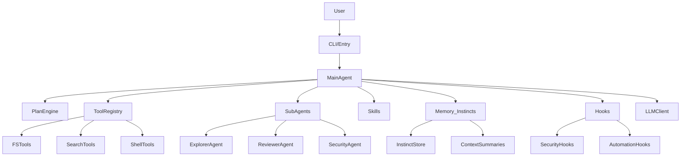

# CAI Agent

Terminal-first coding agent on **LangGraph**: natural language over a workspace (tree, list dir, glob, text search, read/write files, sandboxed commands) against any **OpenAI-compatible** `POST /v1/chat/completions` (defaults work well with [LM Studio](https://lmstudio.ai/)). Optional **Textual** TUI.

> **中文完整说明**：[README.zh-CN.md](README.zh-CN.md)

## Documentation map

- **Quick start**: Requirements → Install → Five-minute path.
- **Design / parity**: Three-source fusion vision (Chinese PRD) + parity matrix + gap analysis; Claude Code & ECC alignment in implementation (sections below).
- **Configuration**: TOML keys, env overrides, sample config.
- **CLI & TUI**: Command reference and slash commands.
- **Changelog**: `CHANGELOG.md` (English default); `CHANGELOG.zh-CN.md` (Chinese).

### CLI highlights

| Goal | Example |
|------|---------|
| Plan only (no tools) | `cai-agent plan "Add auth; outline steps and risks"` |
| Plan JSON (stable schema) | `cai-agent plan "..." --json` → `plan_schema_version`, `ok`, `generated_at`, `task`, `usage` (errors: `config_not_found` / `goal_empty` / `llm_error`) |
| Session stats JSON | `cai-agent stats --json` → `stats_schema_version`, `run_events_total`, `session_summaries`, etc. |
| Save plan to disk | `cai-agent plan "..." --write-plan ./PLAN.md` |
| Run with an existing plan | `cai-agent run --plan-file ./PLAN.md "Implement step 1"` |
| Machine-readable run | `cai-agent run --json "List open risks in the diff"` |
| Sessions | `cai-agent run --save-session .cai-session.json "..."` then `cai-agent continue .cai-session.json "..."` |
| Multi-step workflow | `cai-agent workflow workflow.json --json` (optional root `merge_strategy`: `require_manual`, `last_wins`, `role_priority`) |
| Quality gate / CI | `cai-agent quality-gate --json` (optional `--report-dir DIR`; `[quality_gate]` `test_policy` / `lint_policy`: `skip` or `fail_if_missing`) |
| Security scan | `cai-agent security-scan --json` (`[security_scan]` `exclude_globs`, `rule_overrides`) |
| Memory | `cai-agent memory extract` → `memory/entries.jsonl`; `memory list --json`, `memory search`, `memory prune`; instinct paths via `memory instincts` |
| Cost budget | `cai-agent cost budget --check` (session `total_tokens`; default cap `[cost] budget_max_tokens`; override `--max-tokens`) |
| Observability | `cai-agent observe --json` (stable `schema_version` and aggregates); text mode prints `run_events_total` |
| Cross-tool export | `cai-agent export --target cursor`, `codex`, or `opencode` (`-w` workspace; manifest + README; see `docs/CROSS_HARNESS_COMPATIBILITY.zh-CN.md`) |
| Plugin surface | `cai-agent plugins --json` (`health_score` heuristic) |

### Permissions (tools)

In `cai-agent.toml`, `[permissions]` supports `write_file`, `run_command`, and `fetch_url` with `allow`, `ask`, or `deny`. For `ask` in non-interactive mode, set **`CAI_AUTO_APPROVE=1`** or pass **`--auto-approve`** on `run` / `continue` / `command` / `agent` / `fix-build`.

### Configuration priority

1. Environment variables  
2. TOML (`CAI_CONFIG`, `--config`, or `cai-agent.toml` / `.cai-agent.toml` in cwd)  
3. Built-in defaults  

Do not commit real API keys.

### Further reading (repo docs)

| File | Topic |
|------|--------|
| `docs/ARCHITECTURE.zh-CN.md` | Architecture |
| `docs/ONBOARDING.zh-CN.md` | First-run path and CI (`init` → `doctor` → `run`) |
| `docs/CONTEXT_AND_COMPACT.zh-CN.md` | Context compact hints vs cost / observe |
| `docs/PRODUCT_VISION_FUSION.zh-CN.md` | Product vision: fused “full stack” on unified runtime (L1/L2/L3) |
| `docs/PARITY_MATRIX.zh-CN.md` | Subsystem parity matrix and release checklist |
| `docs/PRODUCT_GAP_ANALYSIS.zh-CN.md` | Gap vs Claude ecosystem + release gates |
| `docs/ROADMAP_EXECUTION.zh-CN.md` | Execution roadmap |
| `docs/MEMORY_AND_COST_GOVERNANCE.zh-CN.md` | Memory and cost |
| `docs/CROSS_HARNESS_COMPATIBILITY.zh-CN.md` | Cursor / Codex / other harnesses |
| `docs/NEXT_IMPLEMENTATION_BUNDLE.zh-CN.md` | Long-form backlog vs fusion vision |
| `docs/MCP_WEB_RECIPE.zh-CN.md` | MCP-only web/search alternative to `fetch_url` |
| `docs/QA_REGRESSION_LOGGING.md` | QA: where regression Markdown logs go; `QA_LOG_DIR` / `QA_SKIP_LOG` |
| `docs/qa/runs/` | Auto-generated per-run reports (`regression-YYYYMMDD-HHmmss.md`) |
| `CHANGELOG.zh-CN.md` | Chinese changelog (default log: `CHANGELOG.md`) |

---

## Five-minute quick start

1. Install (editable):

```bash
cd cai-agent
pip install -e .
```

2. Create config and set the model:

```bash
cai-agent init
```

Edit `cai-agent.toml` `[llm]` or use environment variables.

3. Health check and one task:

```bash
cai-agent doctor
cai-agent run "Summarize this repository layout and name the main modules"
```

4. Optional TUI:

```bash
cai-agent ui -w "$PWD"
```

## Common workflow examples

### 1) Plan only

```bash
cai-agent plan "Add login auth; outline steps and risks"
```

### 2) One-shot run with JSON

```bash
cai-agent run --json "List unfinished TODOs in this repo"
```

### 3) Sessions

```bash
cai-agent run --save-session .cai-session.json "Finish step-one analysis"
cai-agent continue .cai-session.json "Propose an implementation plan"
cai-agent sessions --details
```

### 4) Multi-step `workflow`

```json
{
  "steps": [
    {"name": "scan", "goal": "Map the repo and key modules"},
    {"name": "plan", "goal": "Produce a refactor plan with risks"}
  ]
}
```

```bash
cai-agent workflow workflow.json --json
```

## Alignment with Claude Code / Everything Claude Code

- **North star**: A **fused “full product”** on a **single runtime** (this repo): maximize parity with `anthropics/claude-code` and harness governance patterns from `affaan-m/everything-claude-code`, using `ComeOnOliver/claude-code-analysis` as an **architecture checklist**—without adopting the official TS/Bun/Ink stack and without multi-CLI suite orchestration as the default. See `docs/PRODUCT_VISION_FUSION.zh-CN.md`, `docs/PARITY_MATRIX.zh-CN.md`, and `docs/PRODUCT_GAP_ANALYSIS.zh-CN.md`.
- **Positioning**: Terminal agent similar in spirit to `anthropics/claude-code`, with rules/skills/safety influenced by harness-style workflows (e.g. Everything Claude Code).
- **Subsystems**:
  - **Tools** (`cai_agent.tools`): read/write/search/git/MCP; optional gated **`fetch_url`** (HTTPS GET + host allowlist); workspace sandbox in `cai_agent.sandbox` and allowlisted `run_command`.
  - **Orchestration** (`cai_agent.graph`): LangGraph loop; `run` / `continue` / `sessions` for minimal session management.
  - **TUI** (`cai_agent.tui`): Textual REPL with `/status`, `/models`, `/mcp`, `/save`, `/load`, etc.
  - **Safety**: path confinement, command allowlist, read-only git tools, MCP timeouts/auth.
- **Content**: `rules/common`, `rules/python`, `skills/`, plus `commands/`, `agents/`, `hooks/` as the extensibility surface.

See also: `docs/ARCHITECTURE.zh-CN.md`, `docs/PRODUCT_GAP_ANALYSIS.zh-CN.md`, `docs/ROADMAP_EXECUTION.zh-CN.md`, `docs/MEMORY_AND_COST_GOVERNANCE.zh-CN.md`, `docs/CROSS_HARNESS_COMPATIBILITY.zh-CN.md`, `docs/NEXT_IMPLEMENTATION_BUNDLE.zh-CN.md`, `docs/MCP_WEB_RECIPE.zh-CN.md`.

## Architecture (high level)



## Copilot provider

Built-in **`llm.provider = "copilot"`** for OpenAI-compatible proxies in front of Copilot-style backends.

- **Precedence (copilot mode)**: `COPILOT_*` env > `[copilot]` > `[llm]`.
- **Common vars**: `COPILOT_BASE_URL`, `COPILOT_MODEL`, `COPILOT_API_KEY`.
- **Model listing**: `cai-agent models`; override per run with `--model`.

GitHub does not ship a stable public generic `chat/completions` API; engineering setups usually use a compatible proxy.

## MCP Bridge (optional)

Tools: `mcp_list_tools`, `mcp_call_tool`.

```toml
[mcp]
base_url = "http://localhost:8787"
api_key = "optional-token"
timeout_sec = 20

[agent]
mcp_enabled = true
```

Protocol (current):

- `GET {base_url}/tools` → JSON tool list or string array.
- `POST {base_url}/tools/{name}` with body `{"args":{...}}`.

## Changelog

See **`CHANGELOG.md`** (English). Chinese: **`CHANGELOG.zh-CN.md`**.

## Rules / skills layout

- `rules/common/`, `rules/python/`: engineering and Python conventions.
- `skills/`: reusable workflows.
- `commands/`, `agents/`, `hooks/`: command templates, sub-agents, hook metadata (`hooks.json`).

`cai-agent command` / `cai-agent agent` may auto-inject matching `skills/` text.

---

## Requirements

- Python **3.11+**
- OpenAI-compatible Chat Completions endpoint

## Install

```bash
cd cai-agent
pip install -e .
```

CLI: `cai-agent` (`cai-agent --version`).

## macOS / Linux snippets

```bash
cd /path/to/Cai_Agent/cai-agent
python3 -m pip install -e .
cai-agent init
```

```bash
export LM_PROVIDER=copilot
export COPILOT_BASE_URL=http://localhost:4141/v1
export COPILOT_MODEL=gpt-4o-mini
export COPILOT_API_KEY=your-token
```

```bash
cai-agent doctor
cai-agent models
cai-agent run --workspace "$PWD" "Summarize repo layout"
cai-agent ui -w "$PWD"
cai-agent mcp-check --verbose
cai-agent fix-build "Fix failing tests"
cai-agent security-scan --json
cai-agent security-scan --json --exclude-glob "**/*.md"
cai-agent plugins
cai-agent quality-gate
cai-agent quality-gate --lint --security-scan
cai-agent quality-gate --no-test
cai-agent memory extract --limit 5
cai-agent memory list --json
cai-agent cost budget --check --max-tokens 60000
cai-agent export --target cursor
cai-agent observe --json
```

## Windows snippets

```powershell
cd .\cai-agent
py -m pip install -e .
cai-agent init
set LM_PROVIDER=copilot
set COPILOT_BASE_URL=http://localhost:4141/v1
set COPILOT_MODEL=gpt-4o-mini
set COPILOT_API_KEY=your-token
```

## Configuration file

1. Run **`cai-agent init`** (writes `cai-agent.toml`).
2. Place `cai-agent.toml` in the working directory, or use **`CAI_CONFIG`** / **`--config`**.
3. **Priority**: environment variables > TOML > defaults. Do not commit real API keys.

### `[llm]`

| Key | Meaning |
|-----|---------|
| `base_url` | API base; `/v1` appended if missing |
| `model` | Model id |
| `api_key` | Bearer token |
| `provider` | `openai_compatible` or `copilot` |
| `http_trust_env` | Use system HTTP proxy settings |
| `temperature` | Sampling temperature (clamped) |
| `timeout_sec` | HTTP timeout for chat completions |

### `[agent]`

| Key | Meaning |
|-----|---------|
| `workspace` | Optional workspace root (else cwd / `CAI_WORKSPACE`) |
| `max_iterations` | Max LLM↔tool rounds |
| `command_timeout_sec` | `run_command` timeout |
| `mock` | Skip real LLM when `true` |
| `project_context` | Attach CAI.md-style context when `true` |
| `git_context` | Attach read-only git summary when `true` |
| `mcp_enabled` | Enable MCP tools when `true` |

### Copilot example

```toml
[llm]
provider = "copilot"

[copilot]
base_url = "http://localhost:4141/v1"
model = "gpt-4o-mini"
api_key = "your-copilot-proxy-token"
```

## Environment variables

| Variable | Role |
|----------|------|
| `CAI_CONFIG` | Path to TOML config |
| `CAI_WORKSPACE` | Workspace root |
| `LM_BASE_URL` / `LM_MODEL` / `LM_API_KEY` | LLM endpoint |
| `LM_PROVIDER` | `openai_compatible` or `copilot` |
| `COPILOT_*` | Copilot-mode overrides |
| `MCP_ENABLED` | `1` enables MCP tools |
| `MCP_BASE_URL` / `MCP_API_KEY` / `MCP_TIMEOUT` | MCP bridge |

## Sample `cai-agent.toml`

```toml
[llm]
provider = "openai_compatible"
base_url = "http://localhost:1234/v1"
model = "google/gemma-4-31b"
api_key = "lm-studio"
temperature = 0.2
timeout_sec = 120
http_trust_env = false

[agent]
workspace = "."
max_iterations = 16
command_timeout_sec = 120
mock = false
project_context = true
git_context = true
mcp_enabled = false

[mcp]
base_url = "http://localhost:8787"
api_key = ""
timeout_sec = 20

[copilot]
base_url = "http://localhost:4141/v1"
model = "gpt-4o-mini"
api_key = ""
```

### Production tips

- Prefer `temperature` **0.0–0.2** for stability.
- Raise `max_iterations` for long tasks; pair with `plan` first.
- Increase `timeout_sec` if first-token latency is high.
- Keep `mcp_enabled=false` until you explicitly need MCP.

## Command reference (short)

### `cai-agent doctor`

Validates config, workspace, provider/model.

### `cai-agent run`

Goal → tools → final answer.

### `cai-agent plan`

Read-only plan text; use `--write-plan path.md` to persist. **`plan --json`** adds stable keys: `plan_schema_version`, `generated_at`, `task`, `usage`, plus `goal` / `plan` / `workspace` / `model`.

### `cai-agent run --json`

Machine-readable payload: `answer`, `iteration`, `finished`, `provider`, `model`, `elapsed_ms`, tool stats, tokens, `run_schema_version`, `events`, etc.

## End-to-end demo (analyze → plan → workflow → sessions)

**A** Analyze:

```bash
cai-agent run --save-session .cai-session.json "Analyze core modules and risks"
```

**B** Continue for a plan:

```bash
cai-agent continue .cai-session.json "From the analysis, output a three-phase plan"
```

**C** Workflow JSON then:

```bash
cai-agent workflow workflow.json --json
```

**D** Inspect sessions:

```bash
cai-agent sessions --details
```

Workflow may write instinct snapshots under `memory/` when enabled.

## MCP end-to-end

Enable MCP in TOML, then:

```bash
cai-agent mcp-check --verbose
cai-agent mcp-check --force
cai-agent mcp-check --tool ping --args "{}"
```

In TUI: `/mcp`, `/mcp refresh`, `/mcp call <name> <json_args>`.

## TUI quick path

```bash
cai-agent ui -w "$PWD"
```

Suggested order: `/status` → `/models` → `/use-model <id>` → type a task → `/save` → `/load latest`.

## Workflow JSON schema

Root: `{"steps":[...]}`. Each step:

- `name` (optional)
- `goal` (required)
- `workspace` (optional)
- `model` (optional)
- `role` (optional): `default`, `explorer`, `reviewer`, `security`

Optional root `merge_strategy`: `require_manual`, `last_wins`, `role_priority`.

## CI integration

```bash
cai-agent run --json "Review risks in this change" > cai-report.json
```

Use `error_count`, `tool_calls_count`, `elapsed_ms` as soft quality gates.

## Usage cheat sheet

```bash
cai-agent doctor
cai-agent models
cai-agent commands
cai-agent command plan "Generate a plan for current changes"
cai-agent agents
cai-agent agent code-reviewer "Review this change for risks"
cai-agent sessions
cai-agent sessions --details
cai-agent run --model gpt-4o-mini "Explain project layout"
cai-agent continue .cai-session.json "Continue last task"
cai-agent run --json "Machine-readable output"
cai-agent mcp-check --force --verbose
cai-agent ui -w "$PWD"
cai-agent workflow path/to/workflow.json --json
```

**TUI slash commands**: `/help`, `/status`, `/models`, `/mcp`, `/mcp refresh`, `/mcp call …`, `/save`, `/load`, `/sessions`, `/use-model`, `/reload`, `/clear`.

## FAQ

1. **`doctor` OK but `run` fails** — Check `LM_BASE_URL` / `LM_MODEL` / `LM_API_KEY`; confirm `/v1` and `http_trust_env`.
2. **Tool errors / path blocked** — Paths are workspace-relative; `..` blocked; `run_command` allowlist only — by design.
3. **Non-deterministic answers** — Lower `temperature`; split work (`plan` then `run`); prefer `continue` over fresh sessions.

## Development

```bash
py -m compileall cai-agent/src/cai_agent
```

**Tests and CLI regression** (from the repository root after installing dev extras):

```bash
cd cai-agent
py -m pip install -e ".[dev]"
py -m pytest -q
cd ..
py scripts/run_regression.py
```

`scripts/run_regression.py` shells out to the installed `cai-agent`. `mcp-check` may exit `2` when MCP is disabled; the script treats that as OK. If no inference server is reachable, `models` may fail unless you set `REGRESSION_STRICT_MODELS=1` to require a successful `models` call (for environments where the gateway is always up).

**Regression audit trail**: each successful or failed run writes a timestamped Markdown report under `docs/qa/runs/` (override with `QA_LOG_DIR`; disable with `QA_SKIP_LOG=1`). See `docs/QA_REGRESSION_LOGGING.md` (English) and `docs/QA_REGRESSION_LOGGING.zh-CN.md` (Chinese).

Keep **`README.md` / `README.zh-CN.md`** and **`CHANGELOG.md` / `CHANGELOG.zh-CN.md`** in sync when user-facing behavior changes.

## Tools & security

- **read_file** / **list_dir** / **list_tree** / **write_file**: workspace-relative; optional line range on reads.
- **glob_search** / **search_text**: bounded matches and bytes.
- **git_status** / **git_diff**: read-only.
- **mcp_***: require `mcp_enabled`.
- **run_command**: allowlisted base names only; no shell metacharacters; `cwd` inside workspace.

Implementation: `cai-agent/src/cai_agent/tools.py`, `cai-agent/src/cai_agent/sandbox.py`.

## License

MIT License — use, modify, and redistribute under the license terms.
