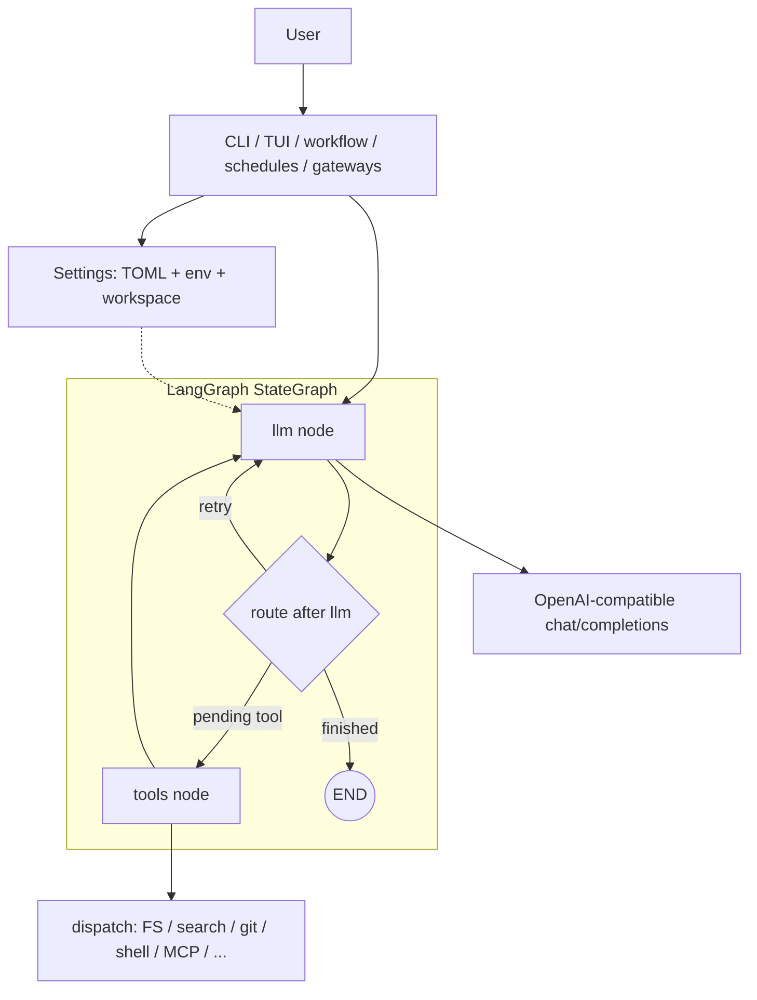

# CAI Agent

Terminal-first coding agent on **LangGraph**: natural language over a workspace (tree, list dir, glob, text search, read/write files, sandboxed commands) against any **OpenAI-compatible** `POST /v1/chat/completions` endpoint (defaults work well with [LM Studio](https://lmstudio.ai/)). Optional **Textual** TUI.

**Chinese README:** [README.zh-CN.md](README.zh-CN.md)

**Planning / backlog (short pointers):** [docs/README.zh-CN.md](docs/README.zh-CN.md) · [CHANGELOG.md](CHANGELOG.md)

---

## Table of contents

1. [Product positioning](#product-positioning)
2. [Design principles](#design-principles)
3. [Architecture](#architecture)
4. [Requirements and install](#requirements-and-install)
5. [Configuration](#configuration)
6. [Permissions and safety](#permissions-and-safety)
7. [Core agent: plan, run, continue, workflow](#core-agent-plan-run-continue-workflow)
8. [Sessions, stats, insights, recall](#sessions-stats-insights-recall)
9. [Memory](#memory)
10. [Models and profiles](#models-and-profiles)
11. [Tools surface (CLI)](#tools-surface-cli)
12. [MCP](#mcp)
13. [Voice, runtime, hooks](#voice-runtime-hooks)
14. [Quality gate, security, cost](#quality-gate-security-cost)
15. [ECC layout, export, plugins](#ecc-layout-export-plugins)
16. [Observe and ops dashboard](#observe-and-ops-dashboard)
17. [Schedules](#schedules)
18. [Gateways](#gateways)
19. [Feedback and repair](#feedback-and-repair)
20. [TUI](#tui)
21. [Repo rules, skills, commands](#repo-rules-skills-commands)
22. [Development and testing](#development-and-testing)

---

## Product positioning

CAI Agent is a **single integrated runtime** that intentionally combines ideas from:

- [anthropics/claude-code](https://github.com/anthropics/claude-code): terminal agent UX and workflow habits
- [NousResearch/hermes-agent](https://github.com/NousResearch/hermes-agent): profiles, dashboards, gateways, schedules, memory contracts, runtime backends
- [affaan-m/everything-claude-code](https://github.com/affaan-m/everything-claude-code): rules, skills, hooks, cross-harness export, governance

The goal is **integration** (one CLI + one graph), not a loose bundle of unrelated tools.

---

## Design principles

1. **Workspace as the trust boundary**  
   All file paths are resolved under the configured workspace. Path traversal (`..`) is rejected. Commands run in a sandboxed allowlist.

2. **One turn, one JSON from the model**  
   The LLM must emit a single JSON object per step: either `{"type":"finish","message":"..."}` or `{"type":"tool","name":"...","args":{...}}`. This keeps parsing deterministic and makes logs replayable.

3. **Explicit configuration layering**  
   Environment variables override TOML; TOML overrides defaults. Config is discovered from `--config`, `CAI_CONFIG`, upward walks from cwd and workspace hints, then optional user-level global config.

4. **Machine-readable outputs for automation**  
   Many subcommands support `--json` with documented `schema_version` fields. Use these in CI instead of scraping text.

5. **Optional integrations are optional**  
   MCP, gateways, remote runtimes, and fetch-url are off unless you turn them on. The default path is local LLM + workspace tools only.

6. **Governance in the repo**  
   `rules/`, `skills/`, `commands/`, `agents/`, and `hooks/` are first-class assets you version with the project; export commands mirror them into Cursor / Codex / OpenCode layouts when needed.

---

## Architecture

High level:

- **Entry**: CLI (`cai_agent/__main__.py`), TUI (`tui.py`), `workflow`, schedules, gateways — all load **Settings** from `config.py` (TOML + env + workspace).
- **Graph**: `cai_agent/graph.py` builds a **LangGraph** `StateGraph`:
  - **llm** node: calls the chat-completions API with system prompt + history; parses one JSON tool call or finish.
  - **route**: after each LLM step, either **END**, **tools**, or back to **llm** (retry / next iteration).
  - **tools** node: `cai_agent/tools.dispatch` runs workspace tools (read/write/list/search/git/shell subset) and optional MCP / fetch_url when enabled.
- **Tools**: Implemented in `tools.py` + `sandbox.py` with strict limits (glob caps, search caps, command allowlist).

Mermaid (simplified):



Plain text:

```text
User → CLI / TUI / workflow / … + Settings (TOML + env + workspace)

START → llm → route → END | tools → llm → …
llm  → HTTP chat/completions
tools → dispatch(...)
```

---

## Requirements and install

- **Python 3.11+** (see `cai-agent/pyproject.toml`).
- An OpenAI-compatible **Chat Completions** base URL and model.

```bash
cd cai-agent
pip install -e .
cai-agent --version
```

**Quick path:**

```bash
cai-agent init
cai-agent doctor
cai-agent run "Summarize this repository layout"
```

**Preset with multiple profiles** (LM Studio / Ollama / vLLM / OpenRouter / Zhipu / gateway placeholder):

```bash
cai-agent init --preset starter
```

**Global user config** (Windows `%APPDATA%\cai-agent\cai-agent.toml`, Linux/macOS `$XDG_CONFIG_HOME/cai-agent/cai-agent.toml`):

```bash
cai-agent init --global
```

**Upgrade note:** if you rely on `--json` shapes from older releases, read [docs/MIGRATION_GUIDE.md](docs/MIGRATION_GUIDE.md) and [CHANGELOG.md](CHANGELOG.md).

---

## Configuration

**Priority:** environment variables > TOML > built-in defaults.

**Discovery order (highest wins first):**

1. `--config <path>`
2. `CAI_CONFIG`
3. Walk up from cwd (up to 12 levels) for `cai-agent.toml` / `.cai-agent.toml`
4. Walk from `CAI_WORKSPACE` and from `-w/--workspace` hint
5. User-level global config path (see above)

**Important keys**

| Section | Role |
|--------|------|
| `[llm]` | `base_url`, `model`, `api_key`, `provider` (`openai_compatible` or `copilot`), `temperature`, `timeout_sec`, `context_window` (TUI denominator; display-only), `http_trust_env` |
| `[copilot]` | Used when `llm.provider = copilot`; overridden by `COPILOT_*` env |
| `[agent]` | `workspace`, `max_iterations`, `command_timeout_sec`, `mock`, `project_context`, `git_context`, `mcp_enabled` |
| `[mcp]` | MCP bridge URL / key / timeout when `mcp_enabled` |
| `[permissions]` | Per-tool policy: `allow` / `ask` / `deny` for `write_file`, `run_command`, `fetch_url` |
| `[models]` | `active` profile id; `[[models.profile]]` blocks for multi-backend setups |

**Zhipu (GLM)** example: `provider = openai_compatible`, `base_url = https://open.bigmodel.cn/api/paas/v4` (no extra `/v1`; runtime normalizes). Use env `ZAI_API_KEY` with `api_key_env = "ZAI_API_KEY"` in the profile.

**Copilot-style proxy:** set `llm.provider = copilot` and `[copilot]` or `COPILOT_BASE_URL` / `COPILOT_MODEL` / `COPILOT_API_KEY`.

---

## Permissions and safety

- **read_file / list_dir / list_tree / write_file**: workspace-relative; `..` blocked.
- **glob_search / search_text**: bounded matches and bytes.
- **git_status / git_diff**: read-only.
- **run_command**: allowlisted executable names only; no shell metacharacters; `cwd` must stay inside workspace.
- **fetch_url**: optional; HTTPS GET with host allowlist unless configured otherwise; gated by `[permissions].fetch_url`.
- **mcp_***: require `[agent].mcp_enabled = true`.

Non-interactive **ask** mode: set `CAI_AUTO_APPROVE=1` or pass `--auto-approve` on `run` / `continue` / `command` / `agent` / `fix-build`.

Do not commit real API keys.

---

## Core agent: plan, run, continue, workflow

### `cai-agent plan`

Read-only planning text (no tool execution). Persist with `--write-plan ./PLAN.md`. Use `--json` for stable keys (`plan_schema_version`, `generated_at`, `task`, `usage`, …).

```bash
cai-agent plan "Add OAuth2 login; list files to touch and risks"
cai-agent plan "..." --json
```

### `cai-agent run`

Single-shot goal → tools loop → final answer. `--json` emits machine-readable run summary (tokens, tools, `run_schema_version`, events, …).

```bash
cai-agent run "List TODOs in src/"
cai-agent run --json "Review security of the diff" -w /path/to/repo
cai-agent run --model gpt-4o-mini "Explain graph.py"
```

### `cai-agent continue`

Resume a saved session file.

```bash
cai-agent run --save-session .cai-session.json "First analysis step"
cai-agent continue .cai-session.json "Now propose implementation steps"
```

### `cai-agent workflow`

Multi-step JSON workflow. Supports `merge_strategy`, `on_error` (`fail_fast` / `continue_on_error`), optional `budget_max_tokens`, per-step `workspace` / `model` / `parallel_group`, and root `quality_gate` (with optional post-workflow gate summary).

```bash
cai-agent workflow workflow.json --json
```

---

## Sessions, stats, insights, recall

| Command | Purpose |
|--------|---------|
| `cai-agent sessions` | List session files; `--details` adds parsed summaries |
| `cai-agent sessions --json` | `sessions_list_v1` |
| `cai-agent stats --json` | Aggregate stats across sessions (`stats_schema_version`, …) |
| `cai-agent insights --json --days 7` | Cross-session trends (`models_top`, `tools_top`, …) |
| `cai-agent recall --query "auth" --days 14 --json` | Search within recent session transcripts |
| `cai-agent recall-index build` / `refresh` / `doctor` | Incremental index for recall at scale |
| `cai-agent recall-index search …` | Search via index |

---

## Memory

Namespace: `cai-agent memory …`

| Subcommand | Purpose |
|-----------|---------|
| `extract` | Extract structured memory → `memory/entries.jsonl` (stdout JSON when applicable) |
| `list --json` | List entries (`memory_list_v1`) |
| `search --json` | Substring search |
| `instincts` | List instinct markdown snapshot paths |
| `validate-entries` / `entries fix` | Validate or repair entries file |
| `prune` | TTL / confidence / cap pruning |
| `state --json` | active/stale/expired distribution |
| `health --json` | Health score, grade, freshness, coverage, conflicts (`--fail-on-grade`) |
| `nudge --json` | Hermes-style “should you extract memory?” reminder |
| `nudge-report --json` | Trend over nudge history |
| `export` / `import` | Bundle memory tree |
| `export-entries` / `import-entries` | Entry-level import/export with validation |
| `provider list|use|test` | Pluggable memory provider registry |
| `user-model --json` | Behavior summary from sessions; `--with-store-v3` includes SQLite snapshot |
| `user-model export` | `user_model_bundle_v1` |
| `user-model store init|list` | SQLite belief store |
| `user-model learn` / `query` | Write/query beliefs |

Typical automation:

```bash
cai-agent memory health --json --fail-on-grade C
cai-agent memory nudge --json --write-file ./.cai/memory-nudge.json --fail-on-severity high
```

---

## Models and profiles

```bash
cai-agent models                    # default: list profiles
cai-agent models list
cai-agent models use <profile_id>
cai-agent models add --preset vllm --id my-vllm --model <id>
cai-agent models add --preset zhipu --id glm --set-active
cai-agent models ping --json
cai-agent models clone …            # clone profile home tree when configured
```

Profiles live under `[models]` / `[[models.profile]]` in TOML; switching active profile updates which LLM endpoint the graph uses.

---

## Tools surface (CLI)

For debugging and CI contracts without running the full agent:

```bash
cai-agent tools contract
cai-agent tools list
cai-agent tools bridge
cai-agent tools guard
cai-agent tools web-fetch --url …   # exercises fetch_url path when enabled
cai-agent tools enable|disable …    # web/image/browser/tts categories
```

---

## MCP

Enable in TOML:

```toml
[agent]
mcp_enabled = true

[mcp]
base_url = "http://localhost:8787"
timeout_sec = 20
```

Then:

```bash
cai-agent mcp-check --verbose
cai-agent mcp-check --force
cai-agent mcp-check --tool ping --args "{}"
```

There is also `cai-agent mcp-serve` for serving MCP-compatible endpoints (see `--help`).

---

## Voice, runtime, hooks

- **`cai-agent voice config|check`**: voice provider contract / health.
- **`cai-agent runtime list`**: registered backends (local, docker, ssh, …).
- **`cai-agent runtime test`**: echo self-test on a chosen backend.
- **`cai-agent hooks list`**: summarize `hooks.json`.
- **`cai-agent hooks run-event …`**: run hook entries (supports dry-run / JSON).

---

## Quality gate, security, cost

```bash
cai-agent quality-gate --json
cai-agent quality-gate --lint --security-scan
cai-agent security-scan --json
cai-agent cost budget --check
cai-agent release-ga --json …       # aggregate gate matrix (see --help for flags)
```

Use `quality_gate` inside `workflow.json` to run a post-workflow gate and surface `quality_gate` / `post_gate` in JSON output.

---

## ECC layout, export, plugins

**Cross-harness export** (Cursor / Codex / OpenCode manifests + README):

```bash
cai-agent export --target cursor -w .
```

**ECC** (Everything Claude Code style layout helpers):

```bash
cai-agent ecc layout --json
cai-agent ecc scaffold
cai-agent ecc catalog …
cai-agent ecc sync …
cai-agent ecc pack …
cai-agent ecc pack-import --from-workspace …   # dry-run by default; --apply --force with backups
cai-agent ecc pack-repair --json               # manifest vs export dirs; exit 2 if error-level issues
```

**`ecc pack-import` ingest gate (ECC-N02-D05)**

- **`--json` plans** include **`ingest_gate`** (**`ecc_pack_ingest_gate_v1`**): scans **`hooks.json`** under the source workspace **`rules` / `skills` / `agents` / `commands`** and applies the same dangerous-command heuristics as runtime **`hook_runtime`** for resolved **`command` / `script`** argv; **`script` paths that escape the source root** are rejected.
- **`--apply`** bails with **`ok=false`**, **`error=ingest_gate_rejected`**, and **no writes** when the gate fails (use the default dry-run / plan JSON to inspect **`ingest_gate`** first).
- The same gate as a **readiness summary for “am I a safe pack source?”**: **`cai-agent doctor --json`** → **`ecc_pack_ingest_gate`**; **`GET /v1/doctor/summary`** → **`ecc_pack_ingest_gate`** (redacted shape).
- Policy context: **`docs/ECC_04B_INGEST_SANITIZER_POLICY.zh-CN.md`** / **`docs/ECC_04B_INGEST_SANITIZER_POLICY.md`** and **`docs/schema/ecc_ingest_sanitizer_policy_v1.snapshot.json`**.

**Plugins**:

```bash
cai-agent plugins --json
cai-agent plugins --json --with-compat-matrix
cai-agent plugins sync-home --target opencode --json
cai-agent plugins sync-home --target opencode --apply --force --json
cai-agent plugins --compat-check
```

`sync-home` previews or applies copying `rules` / `skills` / `agents` / `commands` into harness-specific folders; conflicts can require `--force` (with `.backup-*` behavior as documented in help).

---

## Observe and ops dashboard

```bash
cai-agent observe --json
cai-agent observe-report …
cai-agent ops dashboard --format json|text|html
cai-agent ops serve …               # read-only HTTP sidecar; optional CAI_OPS_API_TOKEN
```

HTTP contract details: [docs/OPS_DYNAMIC_WEB_API.md](docs/OPS_DYNAMIC_WEB_API.md).

---

## Schedules

```bash
cai-agent schedule add --every-minutes 60 --goal "Daily summary"
cai-agent schedule add-memory-nudge --json
cai-agent schedule list --json
cai-agent schedule run-due --json              # dry-run unless --execute
cai-agent schedule daemon --execute --json …
cai-agent schedule stats --json --days 30
```

Audit / schema docs live under `docs/schema/` (e.g. schedule audit JSONL).

---

## Gateways

Unified under `cai-agent gateway …` with sub-trees for Telegram, Discord, Slack, Teams, plus helpers like `gateway platforms list`, `gateway maps summarize`, `gateway federation-summary`, `gateway route-preview`, etc.

Typical Telegram local webhook flow starts with `gateway telegram serve-webhook` and mapping commands (`bind`, `list`, `allow`, …). See gateway-specific docs under `docs/` for env vars and signing secrets (Slack signing secret, Teams manifest, Discord bot token).

---

## Feedback and repair

```bash
cai-agent feedback submit "…"
cai-agent feedback list
cai-agent doctor --json
cai-agent repair …                  # guided fixes where implemented
```

---

## TUI

```bash
cai-agent ui -w "$PWD"
```

Slash commands include `/help`, `/status`, `/models` (or **Ctrl+M**), `/mcp`, `/save`, `/load`, `/sessions`, `/clear`, `/usage`, and project templates from `commands/*.md`. Model panel **Enter** switches the **current session**; persist default with `cai-agent models use <id>` or `[models].active` in TOML.

Context bar uses `prompt_tokens` vs `context_window` (from profile / llm / env / default).

---

## Repo rules, skills, commands

- `rules/common/`, `rules/python/`: engineering conventions.
- `skills/`: reusable workflows (also mirrored under `.cursor/skills` in some setups).
- `commands/`, `agents/`: templates for `cai-agent command` / `cai-agent agent`.
- `hooks/`: `hooks.json` metadata for session automation.

```bash
cai-agent commands
cai-agent command plan "…"
cai-agent agents
cai-agent agent code-reviewer "…"
```

---

## Development and testing

```bash
cd cai-agent
pip install -e ".[dev]"
python -m pytest -q
```

From repo root (after install):

```bash
python scripts/smoke_new_features.py
python scripts/run_regression.py
```

Active engineering checklists: [docs/DEVELOPER_TODOS.zh-CN.md](docs/DEVELOPER_TODOS.zh-CN.md) · [docs/TEST_TODOS.zh-CN.md](docs/TEST_TODOS.zh-CN.md).

Shipped features and migration notes: [CHANGELOG.md](CHANGELOG.md) / [CHANGELOG.zh-CN.md](CHANGELOG.zh-CN.md).

---

## License

MIT License — see repository license file.
