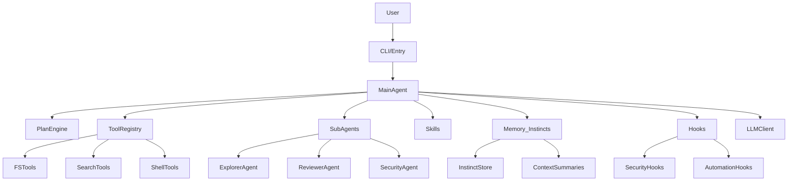

# CAI Agent

> 仓库默认文档为英文：**[README.md](README.md)**。以下为完整中文说明（本文件）。


基于 **LangGraph** 的终端 Agent：在指定工作区内通过自然语言调用「目录树、列目录、glob、文本搜索、按行读文件、读/写文件、受限执行命令」，对接任意 **OpenAI 兼容** `POST /v1/chat/completions` 服务（默认面向 [LM Studio](https://lmstudio.ai/)），可选 **Textual** 交互界面。

## 文档导航

- **[English README（默认）](README.md)**：仓库根目录英文说明。
- **[新用户与 CI 路径](docs/ONBOARDING.zh-CN.md)**：`init` → `doctor` → `run` 与流水线权限说明。
- **[试点用户说明](docs/PILOT_USERS.zh-CN.md)**：小范围试用目标、清单、安全与反馈方式。
- **[上下文压缩与成本](docs/CONTEXT_AND_COMPACT.zh-CN.md)**：`[context]` 压缩提示与 `observe` / `cost` 联动建议。
- **快速上手**：先看“环境要求”+“安装”+“5 分钟跑通”。
- **产品愿景（完全体）**：[docs/PRODUCT_VISION_FUSION.zh-CN.md](docs/PRODUCT_VISION_FUSION.zh-CN.md)（三源融合、统一运行时、L1/L2/L3 验收）。
- **Parity 矩阵**：[docs/PARITY_MATRIX.zh-CN.md](docs/PARITY_MATRIX.zh-CN.md)（发版勾选与 MCP/OOS 约定）。
- **能力边界与缺口**：[docs/PRODUCT_GAP_ANALYSIS.zh-CN.md](docs/PRODUCT_GAP_ANALYSIS.zh-CN.md)（含发布门禁）；另见“与 Claude Code / Everything Claude Code 的功能对齐”+“工具与安全说明”。
- **对标双参考源的本版功能清单（Dev/QA/用户）**：[docs/REFERENCE_PARITY_BACKLOG_2026-04-17.zh-CN.md](docs/REFERENCE_PARITY_BACKLOG_2026-04-17.zh-CN.md)（[claude-code](https://github.com/anthropics/claude-code) + [everything-claude-code](https://github.com/affaan-m/everything-claude-code)）。
- **功能包：界面化模型切换 / 新模型配置**：[docs/MODEL_SWITCHER_BACKLOG.zh-CN.md](docs/MODEL_SWITCHER_BACKLOG.zh-CN.md)（TUI 面板 + `cai-agent models` CLI + 主/子代理路由 + 多供应商：ChatGPT / Claude / 本地）。
- **开发计划（Sprint 1–3，含 Alpha/Beta/GA 节奏）**：[docs/MODEL_SWITCHER_DEVPLAN.zh-CN.md](docs/MODEL_SWITCHER_DEVPLAN.zh-CN.md)（分工、时间片、DoD、QA 回归矩阵、内测公告模板）。
- **QA：S3 TUI 模型面板手工用例计划**：[docs/qa/s3-tui-model-panel-testplan.md](docs/qa/s3-tui-model-panel-testplan.md)（40 条：add/edit/rm/ping/switch 五子动作 + **上下文进度条 UC-CTX-*** + 空态 + 跨 provider `/compact` 提示；冻结日前一天起执行）。
- **补齐总册与 MCP Web**：[docs/NEXT_IMPLEMENTATION_BUNDLE.zh-CN.md](docs/NEXT_IMPLEMENTATION_BUNDLE.zh-CN.md)、[docs/MCP_WEB_RECIPE.zh-CN.md](docs/MCP_WEB_RECIPE.zh-CN.md)。
- **配置细节**：看“配置文件”+“环境变量（覆盖配置文件）”。
- **运行命令**：看“用法”+“内置斜杠命令（UI）”。
- **演进历史**：**[CHANGELOG.md](CHANGELOG.md)**（默认英文）、**[CHANGELOG.zh-CN.md](CHANGELOG.zh-CN.md)**（中文全文）。
- **QA 回归记录**：每次跑 `python scripts/run_regression.py` 会在 `docs/qa/runs/` 生成带时间戳的 Markdown 报告；策略与变量见 **[docs/QA_REGRESSION_LOGGING.zh-CN.md](docs/QA_REGRESSION_LOGGING.zh-CN.md)**（英文镜像：[docs/QA_REGRESSION_LOGGING.md](docs/QA_REGRESSION_LOGGING.md)）。

## 5 分钟跑通（推荐）

1. 安装包（开发模式）：

```bash
cd cai-agent
pip install -e .
```

2. 生成配置并填写模型参数：

```bash
cai-agent init
```

编辑 `cai-agent.toml` 的 `[llm]`（或使用环境变量）。

3. 先做健康检查，再执行一次任务：

```bash
cai-agent doctor
cai-agent run "请总结当前仓库结构，并指出核心模块"
```

4. 需要交互式会话时，启动 TUI：

```bash
cai-agent ui -w "$PWD"
```

## 常见工作流示例

### 1) 只做实现规划（Plan First）

```bash
cai-agent plan "为当前项目增加登录鉴权，并给出分步改造计划"
```

适合在改代码前先审视风险、文件影响面和验证策略。

### 2) 单轮自动执行 + 机器可读输出

```bash
cai-agent run --json "检查当前仓库有哪些未完成的 TODO"
```

适合脚本集成、CI 辅助、自动化流水线。

### 3) 会话保存 / 恢复 / 继续追问

```bash
cai-agent run --save-session .cai-session.json "先完成第一步分析"
cai-agent continue .cai-session.json "继续给出落地实现方案"
cai-agent sessions --details
```

### 4) 多步任务编排（workflow）

`workflow.json` 示例：

```json
{
  "steps": [
    {"name": "scan", "goal": "梳理仓库结构与关键模块"},
    {"name": "plan", "goal": "生成重构计划并列出风险"}
  ]
}
```

运行：

```bash
cai-agent workflow workflow.json --json
```

## 与 Claude Code / Everything Claude Code 的功能对齐

- **北极星（完全体）**：在 **单一运行时**（本仓库的 Python / LangGraph / OpenAI 兼容路径）内融合三类参考——官方 `anthropics/claude-code` 的能力环、`ComeOnOliver/claude-code-analysis` 的架构子系统清单、`affaan-m/everything-claude-code` 的治理与跨 harness 资产；不复制官方 TS/Bun/Ink 栈，默认也不采用「多 CLI 套件」编排。详见 [docs/PRODUCT_VISION_FUSION.zh-CN.md](docs/PRODUCT_VISION_FUSION.zh-CN.md)、[docs/PARITY_MATRIX.zh-CN.md](docs/PARITY_MATRIX.zh-CN.md)、[docs/PRODUCT_GAP_ANALYSIS.zh-CN.md](docs/PRODUCT_GAP_ANALYSIS.zh-CN.md)。
- **整体定位**：`cai-agent` 对标官方 `anthropics/claude-code` 的「终端内智能代码 Agent」，并参考 `affaan-m/everything-claude-code` 的「性能优化 + 安全护栏 + 规则/技能」设计思路。
- **当前已对齐的子系统**（概念层级）：
  - **工具系统（Tools）**：`cai_agent.tools` 提供只读/写入/搜索/Git/MCP、可选 **`fetch_url`（HTTPS 白名单）** 等工具，并通过沙箱 `cai_agent.sandbox` 实现工作区越界防护和命令白名单，类似 Claude Code 的 Tool + 权限模型。
  - **会话与编排（Query/Tasks）**：`cai_agent.graph` 使用 LangGraph 状态机驱动「LLM ↔ 工具」循环，与 Claude Code 的 QueryEngine 思路一致；CLI 的 `run` / `continue` + `sessions` 子命令承担最小会话/任务管理角色。
  - **终端 UI（TUI）**：`cai_agent.tui` 使用 Textual 提供类似 Claude Code REPL 的对话界面和内置斜杠命令（`/status`、`/models`、`/mcp`、`/save`、`/load` 等）。
  - **安全模型（Sandbox & MCP）**：`cai_agent.sandbox` + `run_command` 白名单 + Git 只读工具 + MCP Bridge 的超时/鉴权，与 Everything Claude Code 中的 Agent 安全与沙箱策略保持同类防护思路。
- **已补充的规则与技能库**（内容层级）：
  - **Rules**：`rules/common` 与 `rules/python` 已补充命名/结构、日志/错误、安全/敏感信息、Git/提交、文档/注释、性能/资源、上下文/记忆、MCP/外部工具、Hook 自动化、子代理协作、验证评估、research-first、prompt hygiene、类型风格、测试/CI、依赖/打包、CLI/TUI、配置演进、并发模型、HTTP 调用与重试等主题。
  - **Skills**：`skills/` 已补充 plan-then-execute、search-first、TDD、verification loop、单模块/多模块重构、新功能+测试、调试诊断、轻量安全扫描、安全加固、性能评估、依赖升级、API 集成、规则维护、Hook 设计、子代理编排、记忆提炼、代码评审、测试覆盖审计、发布前检查、workflow 编写、迁移规划、故障复盘、文档同步等可复用工作流。
  - **运行层骨架**：已新增 `commands/`（斜杠命令兼容层）、`agents/`（核心子代理定义）、`hooks/`（自动化配置骨架），用于逐步对齐 ECC 的插件化运行体系。
- **规划中的增强能力**（逐步对齐中）：
  - **计划模式（Plan Mode）**：在执行前生成只读实现方案，风格对齐 Claude Code 的 Plan 模式与 Everything Claude Code 的 “research-first / plan-then-execute”。
  - **规则与技能（Rules / Skills）**：在仓库中提供 `rules/`、`skills/` 目录，结合 CLI/TUI 命令为常见语言和场景提供约束与可复用工作流（参考 ECC 的 `rules/`、`skills/` 结构）。
  - **统计与诊断（Stats）**：在现有 `run --json` / `continue --json` 输出基础上，逐步加入模型调用耗时、token 使用等诊断信息，对齐 Claude Code / ECC 的成本与性能视角。

完整架构说明与后续 Roadmap 见：

- `docs/ARCHITECTURE.zh-CN.md`
- `docs/PRODUCT_VISION_FUSION.zh-CN.md`（三源融合愿景与 L1/L2/L3）
- `docs/PARITY_MATRIX.zh-CN.md`（子系统 parity 与发版约定）
- `docs/PRODUCT_GAP_ANALYSIS.zh-CN.md`（能力对比、缺口与发布门禁）
- `docs/ROADMAP_EXECUTION.zh-CN.md`（P0/P1/P2 落地清单）
- `docs/MEMORY_AND_COST_GOVERNANCE.zh-CN.md`（记忆与成本治理方案）
- `docs/CROSS_HARNESS_COMPATIBILITY.zh-CN.md`（跨工具兼容映射）
- `docs/NEXT_IMPLEMENTATION_BUNDLE.zh-CN.md`（补齐总册 backlog）
- `docs/MCP_WEB_RECIPE.zh-CN.md`（Web 能力 MCP 配方）

## 高层架构示意



## ⭐ Copilot 集成（重点）

`cai-agent` 现已内置 **Copilot provider 模式**（`llm.provider = "copilot"`），用于快速切到 Copilot 生态代理。

- **推荐方式**：通过 OpenAI 兼容代理接入 Copilot，再配置 `base_url/model/api_key`
- **优先级（copilot 模式）**：`COPILOT_*` 环境变量 > `[copilot]` > `[llm]`
- **关键变量**：`COPILOT_BASE_URL`、`COPILOT_MODEL`、`COPILOT_API_KEY`
- **手动选模型**：支持 `--model` 临时覆盖，以及 `cai-agent models` 列出代理当前可用模型

> 注意：GitHub Copilot 官方并未提供稳定公开的通用 `chat/completions` 编程接口；工程上通常通过兼容代理接入。

## MCP Bridge（下一步能力，已接入）

已内置最小 MCP Bridge 集成（可选开启）：

- `mcp_list_tools`：读取外部工具清单
- `mcp_call_tool`：调用外部工具

配置方式（`cai-agent/cai-agent.toml`）：

```toml
[mcp]
base_url = "http://localhost:8787"
api_key = "optional-token"
timeout_sec = 20

[agent]
mcp_enabled = true
```

协议约定（当前版本）：

- `GET {base_url}/tools` -> `{"tools":[{"name":"...","description":"..."}]}` 或 `["tool1", ...]`
- `POST {base_url}/tools/{name}`，Body: `{"args":{...}}`

## 更新日志

- 详细版本历史：**[CHANGELOG.md](CHANGELOG.md)**（默认英文）、**[CHANGELOG.zh-CN.md](CHANGELOG.zh-CN.md)**（中文全文）。
- 发布前请同步更新英文与中文两份变更记录；本 README 中文节仅保留与发行相关的要点时可在此补充。

## Rules / Skills 目录现状

- `rules/common/`：通用工程规则，覆盖结构、日志、安全、Git、文档、性能、上下文记忆、MCP 等主题。
- `rules/python/`：Python 规则，覆盖风格与类型、测试/CI、依赖打包、CLI/TUI、配置演进、并发模型、HTTP 调用与重试等主题。
- `skills/`：可复用工作流，覆盖计划、调研、TDD、验证循环、重构、加功能、调试、安全扫描与加固、性能评估、依赖升级、评审、发布前检查、workflow 编写、迁移规划、复盘与文档同步等任务。
- `commands/`：命令兼容层，提供 `/plan`、`/code-review`、`/verify`、`/fix-build`、`/security-scan`、`/sessions` 等入口定义。
- `agents/`：子代理定义层，提供 `planner`、`code-reviewer`、`security-reviewer`、`debug-resolver`、`doc-updater` 等核心角色模板。
- `hooks/`：会话与操作自动化骨架，提供 `hooks.json` 与 session start/end 建议流程；CLI 会在会话开始/结束读取并输出已启用 hook 标识。
- `cai-agent command` / `cai-agent agent`：会自动尝试匹配并注入 `skills/` 中相关技能内容（同名或前缀匹配），提升命令/角色执行质量。

这些目录当前已经从「骨架」扩展为可实际引用的内容库与运行层雏形；下一步会继续把 `commands/agents/hooks` 接入 `plan` / `workflow` / TUI 命令入口。

---

## 环境要求

- Python **3.11+**
- 提供 OpenAI 兼容 Chat Completions 的推理或 API 服务

## 安装

在仓库根目录下进入 `cai-agent`：

```bash
cd cai-agent
pip install -e .
```

安装后使用命令：`cai-agent`（`cai-agent --version` 查看版本）。

## macOS / Linux 使用

### 安装与初始化

```bash
cd /path/to/Cai_Agent/cai-agent
python3 -m pip install -e .
cai-agent init
cp cai-agent.toml .cai-agent.toml
```

### 环境变量（bash/zsh）

```bash
export LM_PROVIDER=copilot
export COPILOT_BASE_URL=http://localhost:4141/v1
export COPILOT_MODEL=gpt-4o-mini
export COPILOT_API_KEY=your-token
```

### 常用命令（macOS/Linux）

```bash
cai-agent doctor
cai-agent models
cai-agent run --workspace "$PWD" "请总结当前仓库结构"
cai-agent ui -w "$PWD"
cai-agent mcp-check --verbose
cai-agent fix-build "修复当前仓库测试失败问题"
cai-agent security-scan --json
cai-agent security-scan --json --exclude-glob "**/*.md"
cai-agent plugins
cai-agent quality-gate
cai-agent quality-gate --lint --security-scan
cai-agent quality-gate --no-test
cai-agent memory extract --limit 5
cai-agent memory list --limit 10
cai-agent cost budget --check --max-tokens 60000
cai-agent export --target cursor
cai-agent observe --json
```

## Windows 使用

```powershell
cd .\cai-agent
py -m pip install -e .
cai-agent init
set LM_PROVIDER=copilot
set COPILOT_BASE_URL=http://localhost:4141/v1
set COPILOT_MODEL=gpt-4o-mini
set COPILOT_API_KEY=your-token
```

## 快速生成配置

```bash
cd cai-agent
cai-agent init
```

会生成 `cai-agent.toml`，按需编辑其中的 `[llm]` / `[agent]` 即可。

## 配置文件

1. 推荐在 `cai-agent/` 目录内运行 **`cai-agent init`** 生成 `cai-agent.toml`。
2. 将 `cai-agent.toml` 放在运行命令时的当前工作目录，或使用 **`CAI_CONFIG`** / **`--config`**。
3. **优先级**：环境变量 **高于** TOML **高于** 内置默认值。勿将含真实 API Key 的配置提交到版本库。

### `[llm]` 常用项

| 键 | 说明 |
|----|------|
| `base_url` | API 根地址；未以 `/v1` 结尾时会自动补全 |
| `model` | 模型 ID |
| `api_key` | Bearer Token |
| `provider` | `openai_compatible`（默认）或 `copilot` |
| `http_trust_env` | 是否使用系统代理 |
| `temperature` | 采样温度，默认 `0.2`，范围会裁剪到 `0~2` |
| `timeout_sec` | 单次 Chat Completions 请求超时（秒），默认 `120`，范围约 `5~3600` |
| `context_window` | 模型上下文窗口 token 数，**仅用于 TUI 显示**（决定进度条分母），**不会发送给服务端**。默认 `8192`；建议按模型真实窗口设置。支持环境变量 `CAI_CONTEXT_WINDOW` 覆盖，也可在 `[[models.profile]]` 下按 profile 单独设置（优先级更高）。常见值：LM Studio/Qwen/Gemma 本地 32768，gpt-4o 128000，claude-sonnet 200000 |

### `[agent]` 常用项

| 键 | 说明 |
|----|------|
| `workspace` | 可选，工作区根；不设则用当前目录或 `CAI_WORKSPACE` |
| `max_iterations` | LLM↔工具最大轮数 |
| `command_timeout_sec` | `run_command` 进程超时 |
| `mock` | 为 `true` 时不请求真实模型 |
| `project_context` | 为 `true` 时在系统提示中附加根目录说明文件（有长度上限） |
| `git_context` | 为 `true` 时附加只读 `git` 摘要 |
| `mcp_enabled` | 为 `true` 时启用 MCP Bridge 工具 |

### Copilot 代理模式示例（重点）

```toml
[llm]
provider = "copilot"

[copilot]
base_url = "http://localhost:4141/v1"
model = "gpt-4o-mini"
api_key = "your-copilot-proxy-token"
```

## 环境变量（覆盖配置文件）

| 变量 | 含义 |
|------|------|
| `CAI_CONFIG` | TOML 配置文件路径 |
| `CAI_WORKSPACE` | 工作区根目录 |
| `CAI_CONTEXT_WINDOW` | 覆盖 TUI 上下文进度条分母（token 数） |
| `LM_BASE_URL` | API 根 URL |
| `LM_MODEL` | 模型名 |
| `LM_API_KEY` | Bearer Token |
| `LM_PROVIDER` | `openai_compatible` 或 `copilot` |
| `COPILOT_BASE_URL` | Copilot 模式代理 URL |
| `COPILOT_MODEL` | Copilot 模式模型名 |
| `COPILOT_API_KEY` | Copilot 模式 token |
| `MCP_ENABLED` | `1` 时启用 MCP Bridge 工具 |
| `MCP_BASE_URL` | MCP Bridge 基础地址 |
| `MCP_API_KEY` | MCP Bridge 可选鉴权 token |
| `MCP_TIMEOUT` | MCP Bridge 请求超时（秒） |

## 完整配置样例（可直接复制）

以下示例适用于本地 OpenAI 兼容网关（例如 LM Studio / One API / 自建代理）。

```toml
[llm]
provider = "openai_compatible"
base_url = "http://localhost:1234/v1"
model = "google/gemma-4-31b"
api_key = "lm-studio"
temperature = 0.2
timeout_sec = 120
http_trust_env = false
context_window = 32768  # TUI 上下文进度条分母；仅用于显示，不会发送给服务端

[agent]
workspace = "."
max_iterations = 16
command_timeout_sec = 120
mock = false
project_context = true
git_context = true
mcp_enabled = false

[mcp]
base_url = "http://localhost:8787"
api_key = ""
timeout_sec = 20

[copilot]
base_url = "http://localhost:4141/v1"
model = "gpt-4o-mini"
api_key = ""
```

### 配置建议（生产可用）

- **稳定优先**：`temperature=0.0~0.2`，减少结果波动。
- **长任务优先**：适当提高 `max_iterations`（如 24），并配合 `plan` 先拆分任务。
- **超时控制**：若你的网关首 token 慢，可把 `timeout_sec` 提到 `180~300`。
- **安全默认值**：保持 `mcp_enabled=false`，需要时再显式开启。

## 命令详解（带示例输出）

### `cai-agent doctor`

用途：检查当前配置来源、工作区、provider/model 是否符合预期。

```bash
cai-agent doctor
```

典型输出（示意）：

```text
provider=openai_compatible
workspace=/path/to/repo
model=google/gemma-4-31b
config_loaded_from=/path/to/cai-agent.toml
git_repo=true
project_context=true git_context=true
```

### `cai-agent run`

用途：单轮执行“目标 -> 工具调用 -> 最终回答”。

```bash
cai-agent run "请梳理当前仓库目录结构，并给出三条重构建议"
```

### `cai-agent plan`

用途：只输出执行方案，不真正改文件/跑命令。

```bash
cai-agent plan "为本项目补充 CI，并分阶段给出落地步骤"
```

**`plan --json`**：输出一行 JSON，含稳定字段 `plan_schema_version`、`generated_at`、`task`（`plan-*` 任务 id）、`usage`（token 计数）及 `goal` / `plan` 正文等，便于流水线归档。

### `cai-agent run --json`

用途：给自动化脚本消费；适合 CI / 机器人流水线。

```bash
cai-agent run --json "检查最近改动是否存在高风险点"
```

返回字段（核心）：

- `answer`：最终文本回答
- `iteration` / `finished`：推理轮次与是否结束
- `provider` / `model`：实际使用模型
- `elapsed_ms`：总耗时
- `tool_calls_count` / `used_tools` / `error_count`：工具执行统计
- `run_schema_version` / `events`：与落盘会话对齐的轻量事件信封

### `cai-agent sessions --json`

在未加 `--details` 时也会尝试解析每个会话文件并附带 `events_count`、`run_schema_version`、`task_id`、`total_tokens` 等摘要字段（解析失败则带 `parse_error`）。

### `cai-agent stats --json`

汇总当前目录下匹配 `*.cai-session*.json` 的会话：除原有 `sessions_count`、工具调用均值等外，增加 **`stats_schema_version`**（`1.0`）、**`run_events_total`**、**`sessions_with_events`**、**`parse_skipped`** 以及 **`session_summaries`**（逐文件 `events_count` / `task_id` / `total_tokens` / `file_error_count` / `tool_calls_count` / `message_tool_errors`）。**不加 `--json`** 时也会在最后一行摘要中打印 `run_events_total` / `sessions_with_events` / `parse_skipped`。

## Demo：从零到一完成一次“分析 -> 计划 -> 执行 -> 验证”

下面给一个可直接照着跑的最小实战。

### 步骤 A：分析项目

```bash
cai-agent run --save-session .cai-session.json "请先分析当前项目的核心模块和风险点"
```

### 步骤 B：基于分析生成计划

```bash
cai-agent continue .cai-session.json "基于刚才分析，输出可执行的三阶段改造计划"
```

### 步骤 C：把计划转成可追踪 workflow

创建 `workflow.json`：

```json
{
  "steps": [
    {"name": "scan", "goal": "梳理仓库结构、关键模块和风险"},
    {"name": "plan", "goal": "输出三阶段重构计划，给出验证策略"},
    {"name": "verify", "goal": "列出可自动执行的验证命令与回归检查清单"}
  ]
}
```

运行：

```bash
cai-agent workflow workflow.json --json
```

### 步骤 D：检查会话与结果沉淀

```bash
cai-agent sessions --details
```

如果你开启了 memory 相关能力，workflow 结束后会在工作区写入 instinct 快照（用于后续经验沉淀）。

## Demo：MCP 外部工具接入（端到端）

假设你已有 MCP Bridge 服务：

1. 打开配置：

```toml
[agent]
mcp_enabled = true

[mcp]
base_url = "http://localhost:8787"
api_key = "optional-token"
timeout_sec = 20
```

2. 先探活：

```bash
cai-agent mcp-check --verbose
```

3. 拉取工具列表：

```bash
cai-agent mcp-check --force
```

4. 调用具体工具：

```bash
cai-agent mcp-check --tool ping --args "{}"
```

5. 在 TUI 中动态使用：

- `/mcp`
- `/mcp refresh`
- `/mcp call <name> <json_args>`

## Demo：TUI 交互会话（推荐操作顺序）

启动：

```bash
cai-agent ui -w "$PWD"
```

建议顺序：

1. `/status` 看当前模型与工作区
2. `/models` 看可切换模型
3. `/use-model <id>` 切到目标模型
4. 输入自然语言任务
5. `/save` 保存会话
6. `/load latest` 恢复最近会话

### TUI 里常用任务模版

- "请先只做调研，不改文件，列出你要看的文件清单"
- "请基于当前改动给出 code review，按严重级别排序"
- "请生成可执行测试清单，并说明每条如何验证"

### 上下文使用进度条

输入框上方有一行进度条，实时显示当前已用上下文长度：

```
ctx ███░░░░░░░░░░░░░░░░░ ~512 / 32,768 (1.6%) · 估算
```

- 数字含义：**左 = 上次请求实际 `prompt_tokens`**（LM Studio / OpenAI / Anthropic 都会回传），**右 = `Settings.context_window`**。
- 分母来源优先级：`active profile.context_window` > `[llm].context_window` > 环境变量 `CAI_CONTEXT_WINDOW` > 默认 `8192`。把它调成你当前模型的真实窗口才能拿到准确百分比。
- 颜色阈值：**< 70% 绿**、**70–89% 黄**、**≥ 90% 红**。红色出现时建议 `/clear` 或新开 session，避免服务端自动截断。
- 首次响应前（以及每次按 **Enter** 提交后、等模型返回前）用 **CJK 加权估算**：中日韩字符约 1.5 字/token，其它字符约 4 字/token（比整段 `÷4` 更接近中文 tokenizer）；显示 `~` 前缀与"估算"字样；收到响应后用服务端真实 `prompt_tokens` 覆盖。
- 欢迎页与 `/status` 会打印 `context_window` 及 `source=profile|llm|env|default`，便于排查「LM Studio 里设了 35k 但条上仍是 8k」——常见原因是 TUI 从错误工作区启动未读到 `cai-agent.toml`（`source=default`）。
- `/clear` / `/load` / `/use-model` 会重置为估算态，直到下次响应回来。

## JSON workflow 规范（详细）

`workflow` 当前使用 JSON 文件，核心字段如下：

- 根对象：`{"steps":[ ... ]}`
- 每个 step 支持：
  - `name`：步骤名称（可选，不填自动 `step-N`）
  - `goal`：步骤目标（必填）
  - `workspace`：该步骤工作区（可选）
  - `model`：该步骤模型覆盖（可选）

示例（多模型 + 多工作区）：

```json
{
  "steps": [
    {"name": "repo-a-scan", "workspace": "D:/repoA", "goal": "分析代码结构"},
    {"name": "repo-a-plan", "workspace": "D:/repoA", "model": "gpt-4o-mini", "goal": "输出重构计划"},
    {"name": "repo-b-risk", "workspace": "D:/repoB", "goal": "识别安全与稳定性风险"}
  ]
}
```

## 集成建议（CI / 自动化）

你可以把 `run --json` 与 `workflow --json` 作为 CI 任务的一部分：

```bash
cai-agent run --json "审查本次提交潜在风险" > cai-report.json
```

在流水线中读取 `error_count`、`tool_calls_count`、`elapsed_ms` 做阈值判断，作为“辅助质检信号”。

## 用法

```bash
cai-agent doctor
cai-agent models
cai-agent commands
cai-agent command plan "为当前仓库改动生成执行计划"
cai-agent agents
cai-agent agent code-reviewer "审查本次改动并列出风险"
cai-agent sessions
cai-agent sessions --details
cai-agent run --model gpt-4o-mini "解释当前项目结构"
cai-agent continue .cai-session.json "继续上次任务"
cai-agent run --json "输出机器可解析结果"
cai-agent mcp-check --force --verbose
cai-agent mcp-check --tool ping --args "{}"
cai-agent ui -w "$PWD"
# 基于 workflow JSON 依次运行多步任务
cai-agent workflow path/to/workflow.json --json
```

`run --json` / `continue --json` 当前会返回：

- `answer` / `iteration` / `finished`
- `workspace` / `config` / `provider` / `model`
- `mcp_enabled` / `elapsed_ms`
- `tool_calls_count` / `used_tools` / `last_tool` / `error_count`

**内置斜杠命令（UI）：**

- `/help` 或 `/?`
- `/status`
- `/models`
- `/mcp`
- `/mcp refresh`
- `/mcp call <name> <json_args>`
- `/save [path]`（不传则自动命名）
- `/load <path|latest>`
- `/sessions`
- `/use-model <id>`
- `/reload`
- `/clear`

## 常见问题（FAQ）

### 1) `doctor` 正常，但 `run` 请求模型失败

- 检查 `LM_BASE_URL` / `LM_MODEL` / `LM_API_KEY` 是否与当前网关一致。
- 若代理地址没有 `/v1`，程序会自动补全；仍建议显式写完整，便于排查。
- 若走系统代理，确认 `http_trust_env` 设置符合预期。

### 2) 为什么工具调用失败或提示越界

- 所有文件路径都被限制在 `workspace` 内；`..` 越界会被拦截。
- `run_command` 只能执行白名单命令，且禁止路径形式与 shell 元字符。
- 这是设计上的安全边界，不是 bug。

### 3) 为什么结果不稳定

- 先降低 `temperature`（例如 `0.0~0.2`）。
- 把任务拆小：先 `plan`，再 `run`。
- 使用会话持续追问（`continue`）比每次新开任务更稳定。

## 开发与维护建议

- 修改功能后，优先运行：

```bash
py -m compileall cai-agent/src/cai_agent
```

- 单元测试与仓库级 CLI 回归（在仓库根目录）：

```bash
cd cai-agent
py -m pip install -e ".[dev]"
py -m pytest -q
cd ..
py scripts/run_regression.py
```

  `run_regression.py` 会调用已安装的 `cai-agent`，并执行 `scripts/smoke_new_features.py`（校验 `plan` / `run` / `stats` / `sessions` / `observe` 等 JSON 契约）。`mcp-check` 在 MCP 未启用时退出码可能为 `2`，脚本已按预期处理。若本地无推理服务，`models` 可能失败，可设置环境变量 `REGRESSION_STRICT_MODELS=1` 强制要求 `models` 成功（用于网关已就绪的环境）。

  **回归审计留痕**：每次执行结束会在 `docs/qa/runs/` 写入 `regression-YYYYMMDD-HHmmss.md`（可用 `QA_LOG_DIR` 改目录，`QA_SKIP_LOG=1` 关闭写文件）。说明见 [docs/QA_REGRESSION_LOGGING.zh-CN.md](docs/QA_REGRESSION_LOGGING.zh-CN.md)。

- 更新文档建议：
  - 使用说明同步更新 `README.md`（英文）与 `README.zh-CN.md`（中文）；
  - 版本变化同步更新 `CHANGELOG.md`（英文）与 `CHANGELOG.zh-CN.md`（中文）。
- 规则与技能库新增内容时，建议在 PR 描述中标记新增文件，方便团队检索。

## 工具与安全说明

- **read_file** / **list_dir** / **list_tree** / **write_file**：路径相对于工作区，不能越界；`read_file` 可用 `line_start` / `line_end` 控制行范围。
- **glob_search**：`pattern` 与 `root` 不得包含 `..`；结果条数有上限。
- **search_text**：子串搜索；通过 `glob`、`max_files`、`max_matches`、`max_file_bytes` 限制开销。
- **git_status**：只读 `git status`（支持 short 模式）。
- **git_diff**：只读 `git diff`（支持 staged 与 path 参数）。
- **mcp_list_tools**：读取 MCP Bridge 工具清单（需启用）。
- **mcp_call_tool**：调用 MCP Bridge 工具（需启用）。
- **fetch_url**：仅 HTTPS GET；默认关闭，需在 `cai-agent.toml` 的 `[fetch_url]` 启用并配置 `allow_hosts` 主机白名单；受 `[permissions].fetch_url` 约束（`allow` / `ask` / `deny`，与 `write_file` 相同可用 `CAI_AUTO_APPROVE` / `--auto-approve`）。详见示例配置与 [docs/MCP_WEB_RECIPE.zh-CN.md](docs/MCP_WEB_RECIPE.zh-CN.md)（MCP 替代方案）。
- **run_command**：仅允许白名单中的可执行文件名，禁止路径形式与常见 shell 元字符；支持 `cwd` 指定工作区内子目录（默认 `.`）。

实现见 `cai-agent/src/cai_agent/tools.py` 与 `cai-agent/src/cai_agent/sandbox.py`。

## 许可证

本项目采用 **MIT License** 开源协议，你可以在遵守协议条款的前提下自由使用、修改和分发本仓库及其衍生作品。
