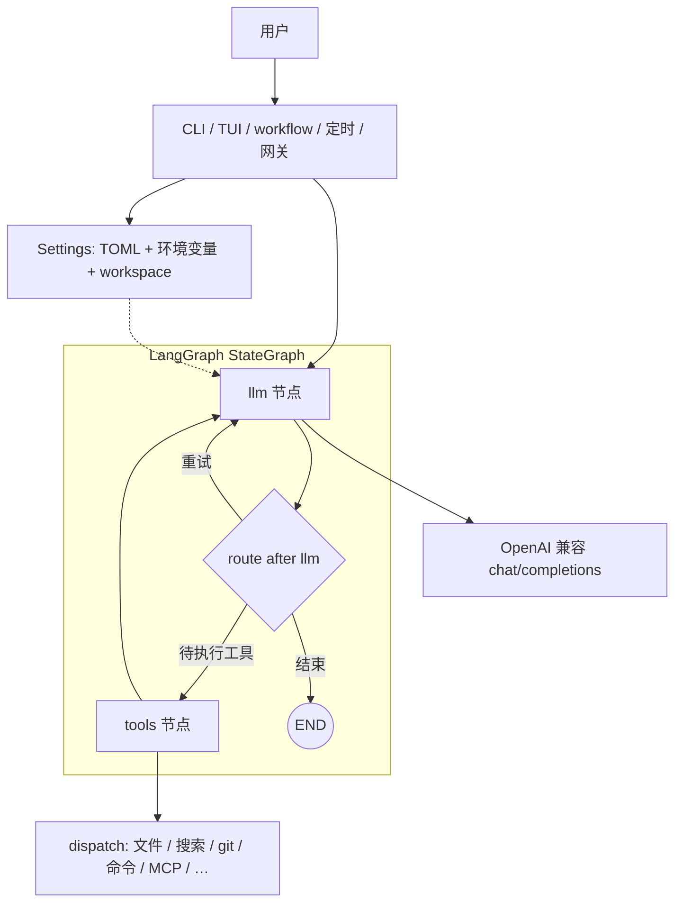

# CAI Agent（中文说明）

> 仓库默认英文入口：[README.md](README.md)。本文件为中文详尽说明。

**文档与计划索引：** [docs/README.zh-CN.md](docs/README.zh-CN.md) · 版本历史：[CHANGELOG.zh-CN.md](CHANGELOG.zh-CN.md)

**主流大模型接入指南：** [docs/MODEL_PROVIDER_INTEGRATION.zh-CN.md](docs/MODEL_PROVIDER_INTEGRATION.zh-CN.md) · English: [docs/MODEL_PROVIDER_INTEGRATION.md](docs/MODEL_PROVIDER_INTEGRATION.md)

---

## 目录

1. [产品定位](#产品定位)
2. [设计原则](#设计原则)
3. [架构说明](#架构说明)
4. [环境与安装](#环境与安装)
5. [配置说明](#配置说明)
6. [权限与安全](#权限与安全)
7. [核心 Agent：plan / run / continue / workflow](#核心-agentplan--run--continue--workflow)
8. [会话、统计、洞察、回忆检索](#会话统计洞察回忆检索)
9. [Memory 记忆子系统](#memory-记忆子系统)
10. [模型与 Profile](#模型与-profile)
11. [Tools 命令行门面](#tools-命令行门面)
12. [Browser 浏览器自动化](#browser-浏览器自动化)
13. [MCP](#mcp)
14. [Voice、Runtime、Hooks](#voiceruntimehooks)
15. [质量门禁、安全扫描、成本](#质量门禁安全扫描成本)
16. [ECC、导出、Plugins](#ecc导出plugins)
17. [可观测性与 Ops 面板](#可观测性与-ops-面板)
18. [定时任务 Schedule](#定时任务-schedule)
19. [Gateway 网关](#gateway-网关)
20. [反馈与修复](#反馈与修复)
21. [TUI 文本界面](#tui-文本界面)
22. [仓库内 rules / skills / commands](#仓库内-rules--skills--commands)
23. [开发与测试](#开发与测试)

---

## 产品定位

CAI Agent 定位为**单一集成运行时**，有意融合三条产品线的长处，而不是堆多套互不相关的 CLI：

- [anthropics/claude-code](https://github.com/anthropics/claude-code)：终端 Agent 体验与工作流习惯
- [NousResearch/hermes-agent](https://github.com/NousResearch/hermes-agent)：多 profile、面板、网关、定时、记忆契约、运行后端等
- [affaan-m/everything-claude-code](https://github.com/affaan-m/everything-claude-code)：rules/skills/hooks、跨 harness 导出、治理模式

目标是「**一个 CLI + 一张 LangGraph**」的集成，而不是松散工具集。

---

## 设计原则

1. **工作区为信任边界**  
   所有文件路径在配置的工作区内解析，禁止 `..` 逃逸。`run_command` 使用白名单与沙箱策略。

2. **每轮模型只输出一个 JSON**  
   每步要么是 `{"type":"finish","message":"..."}`，要么是 `{"type":"tool","name":"…","args":{…}}`。解析稳定、日志可回放，便于自动化。

3. **配置分层显式**  
   环境变量优先于 TOML，TOML优先于默认值。支持从 cwd 向上查找、`CAI_CONFIG`、`--config`，以及用户级全局配置文件。

4. **机读输出优先**  
   大量子命令支持 `--json` 与稳定的 `schema_version`。CI 应消费 JSON，而不是解析终端彩色文本。

5. **可选能力默认关闭**  
   MCP、网关、远程 runtime、`fetch_url` 等需显式开启，默认路径是「本机 LLM + 工作区工具」。

6. **治理资产与代码同库**  
   `rules/`、`skills/`、`commands/`、`agents/`、`hooks/` 与项目一起版本管理；`export` / `plugins sync-home` 等可将资产同步到 Cursor / Codex / OpenCode 等目录结构。

---

## 架构说明

- **入口**：CLI（`__main__.py`）、TUI（`tui.py`）、`workflow`、定时任务、网关等，统一加载 **Settings**（`config.py`：TOML + 环境变量 + workspace）。
- **主循环图**（`cai_agent/graph.py`）：基于 **LangGraph** 的 `StateGraph`：
  - **llm** 节点：带系统提示与历史调用 Chat Completions，解析单 JSON（`finish` 或 `tool`）。
  - **route**：结束后 **END**，否则进入 **tools** 或回到 **llm**（重试 / 下一轮）。
  - **tools** 节点：`tools.dispatch` 执行只读/受限写、搜索、git、白名单命令、可选 MCP / `fetch_url`。
- **工具实现**：`tools.py` + `sandbox.py`，对 glob 命中数、搜索字节、命令名等有硬上限。

**Mermaid 示意：**



**纯文本：**

```text
用户 → CLI / TUI / workflow / … + Settings

START → llm → route → END | tools → llm → …
```

更细的模块叙述可参考 `docs/ARCHITECTURE.zh-CN.md`（若仓库中仍存在该专题文档）。

---

## 环境与安装

- **Python 3.11+**（见 `cai-agent/pyproject.toml` 的 `requires-python`）。
- 任意提供 **OpenAI 兼容 Chat Completions** 的网关或本机推理服务。

```bash
cd cai-agent
pip install -e .
cai-agent --version
```

**最短路径：**

```bash
cai-agent onboarding
cai-agent run "请总结当前仓库目录结构"
```

如需查看完整 dry-run 引导链路（含模型 onboarding、TUI、会话继续），使用：

```bash
cai-agent onboarding --json
```

**多 profile 预设**（LM Studio / Ollama / vLLM / OpenRouter / 智谱 / 自建网关占位）：

```bash
cai-agent init --preset starter
```

**全局用户配置**（Windows：`%APPDATA%\cai-agent\cai-agent.toml`；Linux/macOS：`$XDG_CONFIG_HOME/cai-agent/cai-agent.toml`）：

```bash
cai-agent init --global
```

### TUI 快速启动（从 init 到 UI）

首次在项目里体验 TUI，可按下面顺序执行：

```bash
# 1) 在当前项目生成配置骨架（写入当前工作区）
cai-agent init --preset starter

# 2A) 本地 OpenAI 兼容服务（例如 LM Studio / vLLM）
cai-agent models add --preset lm_studio --id local --model qwen2.5-coder-7b-instruct --set-active

# 2B) 或者接入小米 MiMo（先准备环境变量）
export MIMO_API_KEY="你的密钥"
cai-agent models add --preset xiaomi_mimo --id mimo-pro --set-active
cai-agent models edit mimo-pro --api-key-env MIMO_API_KEY --base-url https://token-plan-cn.xiaomimimo.com/v1 --model mimo-v2.5-pro

# 2C) 或者接入智谱 GLM-5.1（OpenAI 兼容；先准备环境变量）
export ZAI_API_KEY="你的密钥"
cai-agent models add --preset zhipu --id glm51 --model glm-5.1 --set-active

# 2D) 或者接入 DeepSeek（OpenAI 兼容；先准备环境变量）
export DEEPSEEK_API_KEY="你的密钥"
cai-agent models add --preset gateway --id deepseek --model deepseek-chat --set-active
cai-agent models edit deepseek --api-key-env DEEPSEEK_API_KEY --base-url https://api.deepseek.com/v1 --model deepseek-chat

# 3) 连接自检
cai-agent models ping --json

# 4) 进入 TUI（以当前目录为 workspace）
cai-agent ui -w "$PWD"
```

如果你在 PowerShell 中运行，等价写法是：

```powershell
cai-agent ui -w "$PWD"
# 或
cai-agent ui -w (Get-Location).Path
```

**升级注意：** 若流水线依赖 `--json` 字段形态，请先阅读根目录 `CHANGELOG.zh-CN.md` 与 [docs/MIGRATION_GUIDE.md](docs/MIGRATION_GUIDE.md)。
缺配置、旧配置或资产漂移时，`cai-agent onboarding --json`、`cai-agent doctor --json`、`cai-agent repair --dry-run --json` 会输出同源 `install_recovery_flows_v1` / `next_steps`。

---

## 配置说明

**优先级：** 环境变量 > TOML > 内置默认值。

**配置发现顺序（从高到低，命中即停）：**

1. `--config <path>`
2. `CAI_CONFIG`
3. 从当前工作目录向上最多 12 层查找 `cai-agent.toml` / `.cai-agent.toml`
4. 沿 `CAI_WORKSPACE` 与 CLI 的 `-w/--workspace` 提示继续查找
5. 用户级全局配置路径

**常用段落：**

| 段落 | 作用 |
|------|------|
| `[llm]` | `base_url`、`model`、`api_key`、`provider`（`openai_compatible` 或 `copilot`）、`temperature`、`timeout_sec`、`context_window`（**仅 TUI 分母**，不发给模型）、`http_trust_env` |
| `[copilot]` | Copilot 代理模式；可被 `COPILOT_*` 覆盖 |
| `[agent]` | `workspace`、`max_iterations`、`command_timeout_sec`、`mock`、`project_context`、`git_context`、`mcp_enabled` |
| `[mcp]` | MCP Bridge 地址与超时 |
| `[permissions]` | `write_file` / `run_command` / `fetch_url` 的 `allow` / `ask` / `deny` |
| `[models]` | `active`；`[[models.profile]]` 多后端 |

**智谱 GLM：** `provider=openai_compatible`，`base_url=https://open.bigmodel.cn/api/paas/v4`（不要再手动叠 `/v1`）。推荐环境变量 **`ZAI_API_KEY`**，profile 内 `api_key_env = "ZAI_API_KEY"`。

**小米 MiMo：** OpenAI 兼容预设为 `xiaomi_mimo`，默认模型 `MiMo-V2.5-Pro`。若你使用官方 OpenCode 风格的 key，建议将 profile 改为 `api_key_env = "MIMO_API_KEY"`，并覆盖为你的专属 `base_url`（例如 `https://token-plan-cn.xiaomimimo.com/v1`）。

**Copilot 代理：** `llm.provider = copilot`，并配置 `[copilot]` 或 `COPILOT_BASE_URL` / `COPILOT_MODEL` / `COPILOT_API_KEY`。注意：GitHub 官方不提供稳定通用 `chat/completions` 公共接口，工程上多为自建兼容代理。

---

## 权限与安全

- **read_file / list_dir / list_tree / write_file**：相对工作区；禁止 `..`。
- **glob_search / search_text**：有结果条数与扫描上限。
- **git_status / git_diff**：只读。
- **run_command**：仅允许白名单中的可执行文件名；禁止 shell 元字符；`cwd` 必须在工作区内。
- **fetch_url**：默认关闭或强白名单；受 `[permissions].fetch_url` 约束。
- **mcp_***：需 `[agent].mcp_enabled = true`。

非交互下 **`ask` 策略**：使用 `CAI_AUTO_APPROVE=1` 或 `run` / `continue` / `command` / `agent` / `fix-build` 上的 **`--auto-approve`**。

勿将真实 API Key 提交到版本库。

---

## 核心 Agent：plan / run / continue / workflow

### `cai-agent plan`

只生成计划文本，不执行工具。可用 `--write-plan` 落盘；`--json` 输出稳定字段（`plan_schema_version`、`generated_at`、`task`、`usage` 等）。

```bash
cai-agent plan "为当前项目增加登录，列出改动文件与风险"
cai-agent plan "…" --json
```

### `cai-agent run`

单轮或多轮工具循环直到 `finish` 或达到 `max_iterations`。`--json` 输出可机读的运行摘要（token、工具统计、`run_schema_version`、`events` 等）。

```bash
cai-agent run "列出 src 下未完成任务"
cai-agent run --json "审查本次改动的安全风险" -w D:/repo
```

### `cai-agent continue`

基于已保存会话文件继续对话。

```bash
cai-agent run --save-session .cai-session.json "先做需求分析"
cai-agent continue .cai-session.json "在分析基础上给出实现步骤"
```

### `cai-agent workflow`

读取 JSON 工作流，多步顺序或并行组执行。支持根级 `merge_strategy`、`on_error`、`budget_max_tokens`、每步 `workspace` / `model` / `parallel_group`，以及根级 `quality_gate`（workflow 成功后可触发后置门禁并在 JSON 中带 `quality_gate` / `post_gate`）。

```bash
cai-agent workflow workflow.json --json
```

---

## 会话、统计、洞察、回忆检索

| 命令 | 用途 |
|------|------|
| `cai-agent sessions` | 列出会话文件；`--details` 解析摘要 |
| `cai-agent sessions --json` | `sessions_list_v1` |
| `cai-agent stats --json` | 跨会话汇总统计 |
| `cai-agent insights --json --days 7` | 跨会话趋势（模型、工具、错误会话等） |
| `cai-agent recall --query "关键词" --days 14 --json` | 在近期会话中检索 |
| `cai-agent recall-index build` / `refresh` / `doctor` | 大规模下的索引构建与一致性检查 |
| `cai-agent recall-index search` | 走索引的检索 |

---

## Memory 记忆子系统

命令空间：`cai-agent memory …`

| 子命令 | 用途 |
|--------|------|
| `extract` | 从会话提取结构化记忆 → `memory/entries.jsonl` 等 |
| `list --json` | 列出条目（`memory_list_v1`） |
| `search --json` | 子串搜索 |
| `instincts` | instinct Markdown 快照路径 |
| `validate-entries` / `entries fix` | 校验 / 修复条目文件 |
| `prune` | 按策略裁剪过期、低置信或超额条目 |
| `state --json` | active/stale/expired 分布 |
| `health --json` | 健康分、档位、新鲜度、覆盖率、冲突等（`--fail-on-grade`） |
| `nudge --json` | 是否该做 memory extract 等提醒 |
| `nudge-report --json` | 历史 nudge 趋势 |
| `export` / `import` | 目录级导入导出 |
| `export-entries` / `import-entries` | 条目级 bundle（带校验） |
| `provider list|use|test` | 可插拔 memory provider |
| `user-model --json` | 从会话统计行为概览；`--with-store-v3` 带 SQLite 快照 |
| `user-model export` | 导出 `user_model_bundle_v1` |
| `user-model store init|list` | SQLite belief 库 |
| `user-model learn` / `query` | 写入 / 查询 belief |

示例：

```bash
cai-agent memory health --json --fail-on-grade C
cai-agent memory nudge --json --write-file ./.cai/memory-nudge.json --fail-on-severity high
```

---

## 模型与 Profile

主流云厂商、聚合网关与本地运行时的逐项接入方式，见：[docs/MODEL_PROVIDER_INTEGRATION.zh-CN.md](docs/MODEL_PROVIDER_INTEGRATION.zh-CN.md)。

```bash
cai-agent models
cai-agent models list
cai-agent models use <profile_id>
cai-agent models add --preset vllm --id my-vllm --model <服务侧模型名>
cai-agent models add --preset zhipu --id glm --set-active
cai-agent models add --preset xiaomi_mimo --id mimo-pro --set-active
cai-agent models ping --json
cai-agent models clone …          # 在启用 profile home 时克隆隔离目录
```

MiMo 官方 key 映射示例：

```bash
cai-agent models edit mimo-pro --api-key-env MIMO_API_KEY --base-url https://token-plan-cn.xiaomimimo.com/v1 --model mimo-v2.5-pro
```

TUI 内 **`/models` 或 Ctrl+M`** 可在**当前进程**切换会话所用 profile；要下次启动仍生效，请使用 `models use` 或改 `[models].active`。

---

## Tools 命令行门面

用于不跑完整 Agent 时检查工具契约与注册表：

```bash
cai-agent tools contract
cai-agent tools list
cai-agent tools bridge
cai-agent tools guard
cai-agent tools web-fetch --url …
cai-agent tools browser-check --json
cai-agent tools enable|disable …
```

---

## Browser 浏览器自动化

浏览器能力采用 **MCP first**：CAI Agent 不把浏览器运行时绑进核心依赖，而是检查并调用已配置的 Browser MCP provider；默认引导路径是 Playwright MCP preset。

就绪检查与模板发现：

```bash
cai-agent mcp-check --preset browser --list-only --json
cai-agent mcp-check --preset browser --print-template
cai-agent tools bridge --preset browser --json
cai-agent tools browser-check --json
cai-agent browser check --json
```

只生成浏览器任务计划、不执行：

```bash
cai-agent browser task --url https://example.com "总结当前可见页面" --json
```

只有在显式确认后才执行当前支持的 MCP 映射调用：

```bash
cai-agent browser task --url https://example.com "打开页面并抓取页面快照" --execute --confirm --json
```

当前执行映射刻意保持窄口径：`navigate` 映射为 `browser_navigate`，委托页面审阅映射为 `browser_snapshot`。点击、输入、上传、下载等更敏感动作需要先进入新的计划步骤，并绑定显式确认后再扩展。拒绝执行与确认执行都会追加 `.cai/browser/audit.jsonl`，并刷新 `.cai/browser/artifacts-manifest.json`；截图、下载、trace 统一落在 `.cai/browser/` 下。JSON 契约见 [docs/schema/README.zh-CN.md](docs/schema/README.zh-CN.md)，治理边界见 [docs/BROWSER_PROVIDER_RFC.zh-CN.md](docs/BROWSER_PROVIDER_RFC.zh-CN.md)，主要 schema 包括 `browser_provider_check_v1`、`browser_task_v1`、`browser_mcp_execution_v1`、`browser_audit_event_v1`。

---

## MCP

在 `cai-agent.toml` 中启用：

```toml
[agent]
mcp_enabled = true

[mcp]
base_url = "http://localhost:8787"
timeout_sec = 20
```

探活与调用：

```bash
cai-agent mcp-check --verbose
cai-agent mcp-check --force
cai-agent mcp-check --tool ping --args "{}"
```

另有 `cai-agent mcp-serve`（详见 `--help`）。

---

## Voice、Runtime、Hooks

- `cai-agent voice config|check`：语音 provider 契约与检查。
- `cai-agent runtime list`：列出已注册运行后端；`runtime test` 做 echo 自检。
- `cai-agent hooks list` / `hooks run-event …`：读取并执行 `hooks.json` 中事件（支持 dry-run / JSON）。

---

## 质量门禁、安全扫描、成本

```bash
cai-agent quality-gate --json
cai-agent quality-gate --lint --security-scan
cai-agent security-scan --json
cai-agent cost budget --check --max-tokens 60000
cai-agent release-ga --json …
```

在 `workflow.json` 根级配置 `quality_gate` 可在 workflow 成功后自动跑一轮门禁并把结果写入 JSON。

---

## ECC、导出、Plugins

**跨工具导出：**

```bash
cai-agent export --target cursor -w .
```

**ECC 子命令（布局、脚手架、目录、同步、打包、导入等）：**

```bash
cai-agent ecc layout --json
cai-agent ecc scaffold
cai-agent ecc catalog …
cai-agent ecc sync …
cai-agent ecc pack …
cai-agent ecc pack-import --from-workspace …   # 默认预览；需 --apply；冲突处理见 --help
cai-agent ecc pack-repair --json               # 对照 manifest 与各 harness 导出；有 error 级问题时 exit 2
```

**`ecc pack-import` 与 ingest 门禁（ECC-N02-D05）**

- 默认 **`--json` 计划**里会附带 **`ingest_gate`**（**`ecc_pack_ingest_gate_v1`**）：扫描源工作区 **`rules` / `skills` / `agents` / `commands`** 下各 **`hooks.json`**，对可解析的 **`command` / `script`** 使用与运行时 **`hook_runtime`** 一致的危险命令规则；**`script` 路径越出源根**也会阻断。
- 使用 **`--apply`** 写入前若门禁未通过，则 **`ok=false`**、**`error=ingest_gate_rejected`**，且**不落盘**（可先按默认 dry-run 看 **`ingest_gate`**）。
- 当前工作区作为「他人 `pack-import` 的源」时的同一套预检摘要：**`cai-agent doctor --json`** → **`ecc_pack_ingest_gate`**；**`GET /v1/doctor/summary`** → **`ecc_pack_ingest_gate`**（精简字段）。
- 策略背景见 **`docs/ECC_04B_INGEST_SANITIZER_POLICY.zh-CN.md`** 与快照 **`docs/schema/ecc_ingest_sanitizer_policy_v1.snapshot.json`**。
- **`cai-agent skills hub install`**：若 manifest 条目含待复制的 **`hooks.json`**，会在 **`--json` 输出**中附带同一 **`ecc_pack_ingest_gate_v1`**（**`ingest_scan_kind=explicit_hooks`**）；非 **`--dry-run`** 写入前若未通过则 **`error=ingest_gate_rejected`** 且不落盘。

**Plugins：**

```bash
cai-agent plugins --json
cai-agent plugins --json --with-compat-matrix
cai-agent plugins sync-home --target opencode --json
cai-agent plugins sync-home --target opencode --apply --force --json
cai-agent plugins --compat-check
```

`sync-home` 将仓库内 `rules` / `skills` / `agents` / `commands` 同步到各 harness 约定目录；`--apply` 写入，`--force` 在冲突时覆盖并可能产生 `.backup-*`（详见命令帮助）。

---

## 可观测性与 Ops 面板

```bash
cai-agent observe --json
cai-agent observe-report …
cai-agent ops dashboard --format json|text|html
cai-agent ops serve …
```

HTTP 侧车与路径说明见 [docs/OPS_DYNAMIC_WEB_API.zh-CN.md](docs/OPS_DYNAMIC_WEB_API.zh-CN.md)（或英文 `docs/OPS_DYNAMIC_WEB_API.md`）。若设置 `CAI_OPS_API_TOKEN`，请求需带 `Authorization: Bearer …`。

---

## 定时任务 Schedule

```bash
cai-agent schedule add --every-minutes 60 --goal "每日仓库健康摘要"
cai-agent schedule add-memory-nudge --json
cai-agent schedule list --json
cai-agent schedule run-due --json              # 默认 dry-run；加 --execute 才真正执行
cai-agent schedule daemon --execute --json …
cai-agent schedule stats --json --days 30
```

审计 JSONL 等 schema 见 `docs/schema/` 下 SCHEDULE 相关文档。

---

## Gateway 网关

统一在 `cai-agent gateway` 下：`telegram`、`discord`、`slack`、`teams` 等子树，以及 `gateway platforms list`、`gateway maps summarize`、`gateway federation-summary` 等辅助命令。

各平台需配置 Bot Token、签名密钥、Webhook URL 等；具体字段以各子命令 `--help` 与 `docs/GATEWAY_*.zh-CN.md` 为准。

---

## 反馈与修复

```bash
cai-agent feedback submit "界面建议：…"
cai-agent feedback list
cai-agent doctor --json
cai-agent repair …
```

---

## TUI 文本界面

```bash
cai-agent ui -w "$PWD"
```

建议顺序：`/status` → **`Ctrl+M` 或 `/models`**（模型面板）→ 输入任务 → `/save`。内置斜杠含 `/help`、`/mcp`、`/sessions`、`/clear`、`/usage` 等；`commands/*.md` 中的项目命令会被发现并出现在菜单中。

**上下文条：** 显示上次请求的 `prompt_tokens` 相对 `context_window`（来源可为显式 profile / 托管模型自动默认值 / llm / env / default）。颜色阈值大致为：绿色表示低于 70%，黄色 70%–89%，红色 90% 及以上。

---

## 仓库内 rules / skills / commands

- `rules/common/`、`rules/python/`：工程与语言约定。
- `skills/`：可复用工作流说明。
- `commands/`、`agents/`：`cai-agent command` / `cai-agent agent` 的模板发现路径。
- `hooks/`：`hooks.json` 与会话钩子元数据。

```bash
cai-agent commands
cai-agent command plan "为当前改动写执行计划"
cai-agent agents
cai-agent agent code-reviewer "按严重级别列出风险"
cai-agent fix-build "修复当前测试失败"
```

---

## 开发与测试

```bash
cd cai-agent
pip install -e ".[dev]"
python -m pytest -q
```

在仓库根目录：

```bash
python scripts/smoke_new_features.py
python scripts/run_regression.py
```

**执行面文档：** [docs/DEVELOPER_TODOS.zh-CN.md](docs/DEVELOPER_TODOS.zh-CN.md) · [docs/TEST_TODOS.zh-CN.md](docs/TEST_TODOS.zh-CN.md)

**已发布能力与破坏性变更：** [CHANGELOG.zh-CN.md](CHANGELOG.zh-CN.md)

---

## 许可证

MIT License — 见仓库内许可证文件。
 
