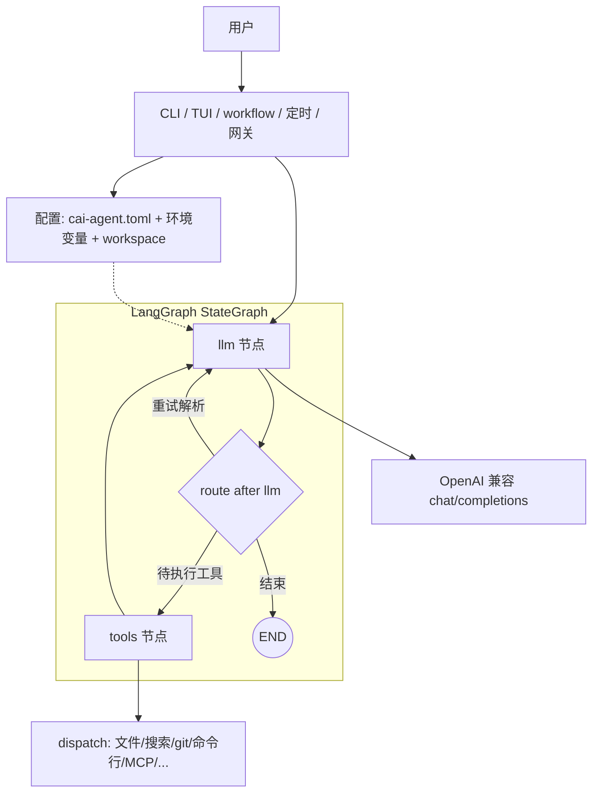

# CAI Agent

> 仓库默认文档为英文：**[README.md](README.md)**。以下为完整中文说明（本文件）。


基于 **LangGraph** 的终端 Agent：在指定工作区内通过自然语言调用「目录树、列目录、glob、文本搜索、按行读文件、读/写文件、受限执行命令」，对接任意 **OpenAI 兼容** `POST /v1/chat/completions` 服务（默认面向 [LM Studio](https://lmstudio.ai/)），可选 **Textual** 交互界面。

## 文档导航

- **[English README（默认）](README.md)**：仓库根目录英文说明。
- **[文档总览（推荐入口）](docs/README.zh-CN.md)**：先看这页，了解哪些文档是权威、哪些只是历史留档。
- **[新用户与 CI 路径](docs/ONBOARDING.zh-CN.md)**：`init` → `doctor` → `run`。
- **[唯一执行清单](docs/PRODUCT_PLAN.zh-CN.md)**：当前能力、测试进度、开发项状态。
- **[当前阶段开发计划](docs/ROADMAP_EXECUTION.zh-CN.md)**：下一阶段开发顺序与里程碑。
- **[缺口与边界](docs/PRODUCT_GAP_ANALYSIS.zh-CN.md)**：P1/P2 缺口、OOS、发版门禁。
- **[Parity 矩阵](docs/PARITY_MATRIX.zh-CN.md)**：发版勾选与 `Done/Next/MCP/OOS`。
- **[一页实现摘要](docs/IMPLEMENTATION_STATUS.zh-CN.md)**：只看近期交付与仍未完成。
- **[JSON 契约索引](docs/schema/README.zh-CN.md)**：`--json` 输出、`schema_version`、exit 码。
- **[专题文档目录](docs/README.zh-CN.md)**：Memory、Ops Web、Runtime、MCP、模型路由、兼容矩阵等专题统一从这里进入。

## 5 分钟跑通（推荐）

1. 安装包（开发模式）：

```bash
cd cai-agent
pip install -e .
```

2. 生成配置并填写模型参数：

```bash
cai-agent init
```

若希望**一次拿到**「本机 LM Studio / Ollama / vLLM + OpenRouter + **智谱 GLM** + 自建 OpenAI 兼容网关」多条 `[[models.profile]]`，可用：

```bash
cai-agent init --preset starter
```

编辑 `cai-agent.toml` 的 `[llm]` 或切换 `[models].active`（或使用环境变量）。单条 profile 也可用 CLI：`cai-agent models add --preset vllm --id my-vllm --model <与 vLLM 一致的模型名>`；自建网关：`models add --preset gateway --id corp --base-url http://内网:8080/v1`；智谱：`models add --preset zhipu --id my-glm`（需环境变量 **`ZAI_API_KEY`**，见[智谱 OpenAI 兼容说明](https://docs.bigmodel.cn/cn/guide/develop/openai/introduction)）。

3. 先做健康检查，再执行一次任务：

```bash
cai-agent doctor
cai-agent run "请总结当前仓库结构，并指出核心模块"
```

4. 需要交互式会话时，启动 TUI：

```bash
cai-agent ui -w "$PWD"
```

## 常见工作流示例

### 1) 只做实现规划（Plan First）

```bash
cai-agent plan "为当前项目增加登录鉴权，并给出分步改造计划"
```

适合在改代码前先审视风险、文件影响面和验证策略。

### 2) 单轮自动执行 + 机器可读输出

```bash
cai-agent run --json "检查当前仓库有哪些未完成的 TODO"
```

适合脚本集成、CI 辅助、自动化流水线。

### 3) 会话保存 / 恢复 / 继续追问

```bash
cai-agent run --save-session .cai-session.json "先完成第一步分析"
cai-agent continue .cai-session.json "继续给出落地实现方案"
cai-agent sessions --details
```

### 4) 多步任务编排（workflow）

`workflow.json` 示例：

```json
{
  "on_error": "continue_on_error",
  "budget_max_tokens": 12000,
  "quality_gate": {
    "lint": true,
    "security_scan": true,
    "report_dir": ".cai/qg-report"
  },
  "steps": [
    {"name": "scan", "goal": "梳理仓库结构与关键模块"},
    {"name": "plan", "goal": "生成重构计划并列出风险"}
  ]
}
```

运行：

```bash
cai-agent workflow workflow.json --json
```

workflow root 也支持 `quality_gate: true | {...}`。当 workflow 本身先成功结束时，CAI 会自动补跑一次后置 `quality-gate`，并在结果中返回 `quality_gate` 摘要与可选 `post_gate`（`quality_gate_result_v1`）；如果 gate 失败，workflow 会整体失败。

## 产品定位

`cai-agent` 当前明确定位为：在 **一个统一运行时** 里整合三条上游产品线，而不是分别包装三套 CLI。

- [`anthropics/claude-code`](https://github.com/anthropics/claude-code)：终端 Agent 的官方体验基线
- [`NousResearch/hermes-agent`](https://github.com/NousResearch/hermes-agent)：profiles、API/server、gateway、dashboard、voice、runtime backend、memory provider 等产品化能力
- [`affaan-m/everything-claude-code`](https://github.com/affaan-m/everything-claude-code)：rules / skills / hooks / model-route / 跨 harness 导出等治理与生态能力

目标是“**集成成一个产品**”，不是复制官方 TS/Bun/Ink 栈，也不是做成多 CLI 套件。详细定位、缺口和路线图见：

- [docs/PRODUCT_VISION_FUSION.zh-CN.md](docs/PRODUCT_VISION_FUSION.zh-CN.md)
- [docs/PRODUCT_GAP_ANALYSIS.zh-CN.md](docs/PRODUCT_GAP_ANALYSIS.zh-CN.md)
- [docs/PRODUCT_PLAN.zh-CN.md](docs/PRODUCT_PLAN.zh-CN.md)
- [docs/ROADMAP_EXECUTION.zh-CN.md](docs/ROADMAP_EXECUTION.zh-CN.md)
- [docs/README.zh-CN.md](docs/README.zh-CN.md)

## 高层架构示意

执行主循环在 **`cai_agent/graph.py`**：用 **LangGraph** 的 `StateGraph` 实现 **llm** 节点（每轮模型只输出一个 JSON：`finish` 或 `tool`）与 **tools** 节点（`dispatch` → 工作区工具 + 可选 MCP），边为 `llm → route →（结束 | tools | 再进 llm）` 以及 `tools → llm`，直到结束或达到 `max_iterations`。CLI、TUI、`plan`、`workflow`、定时任务与网关等都在同一套 **Settings**（TOML + 环境变量 + workspace）之上编排该图（及相关子命令）。



若阅读器不渲染 Mermaid，可用下列纯文本总览：

```text
  用户 → CLI / TUI / workflow / …（+ Settings：TOML + 环境变量 + workspace）

  LangGraph StateGraph（示意）：
    START → llm → route：
                ├─► END                        （已结束）
                ├─► tools → llm → route → …  （一轮工具执行）
                └─► llm → route → …          （重试 JSON / 下一轮）

  llm   → OpenAI 兼容 chat/completions
  tools → dispatch（文件 / 搜索 / git / 命令行 / MCP / …）
```

更细的叙述见 [`docs/ARCHITECTURE.zh-CN.md`](docs/ARCHITECTURE.zh-CN.md)。

## ⭐ Copilot 集成（重点）

`cai-agent` 现已内置 **Copilot provider 模式**（`llm.provider = "copilot"`），用于快速切到 Copilot 生态代理。

- **推荐方式**：通过 OpenAI 兼容代理接入 Copilot，再配置 `base_url/model/api_key`
- **优先级（copilot 模式）**：`COPILOT_*` 环境变量 > `[copilot]` > `[llm]`
- **关键变量**：`COPILOT_BASE_URL`、`COPILOT_MODEL`、`COPILOT_API_KEY`
- **手动选模型**：支持 `--model` 临时覆盖，以及 `cai-agent models` 列出代理当前可用模型

> 注意：GitHub Copilot 官方并未提供稳定公开的通用 `chat/completions` 编程接口；工程上通常通过兼容代理接入。

## MCP Bridge（下一步能力，已接入）

已内置最小 MCP Bridge 集成（可选开启）：

- `mcp_list_tools`：读取外部工具清单
- `mcp_call_tool`：调用外部工具

配置方式（`cai-agent/cai-agent.toml`）：

```toml
[mcp]
base_url = "http://localhost:8787"
api_key = "optional-token"
timeout_sec = 20

[agent]
mcp_enabled = true
```

协议约定（当前版本）：

- `GET {base_url}/tools` -> `{"tools":[{"name":"...","description":"..."}]}` 或 `["tool1", ...]`
- `POST {base_url}/tools/{name}`，Body: `{"args":{...}}`

## 更新日志

- 详细版本历史：**[CHANGELOG.md](CHANGELOG.md)**（默认英文）、**[CHANGELOG.zh-CN.md](CHANGELOG.zh-CN.md)**（中文全文）。
- 发布前请同步更新英文与中文两份变更记录；本 README 中文节仅保留与发行相关的要点时可在此补充。

## Rules / Skills 目录现状

- `rules/common/`：通用工程规则，覆盖结构、日志、安全、Git、文档、性能、上下文记忆、MCP 等主题。
- `rules/python/`：Python 规则，覆盖风格与类型、测试/CI、依赖打包、CLI/TUI、配置演进、并发模型、HTTP 调用与重试等主题。
- `skills/`：可复用工作流，覆盖计划、调研、TDD、验证循环、重构、加功能、调试、安全扫描与加固、性能评估、依赖升级、评审、发布前检查、workflow 编写、迁移规划、复盘与文档同步等任务。
- `commands/`：命令兼容层，提供 `/plan`、`/code-review`、`/verify`、`/fix-build`、`/security-scan`、`/sessions` 等入口定义。
- `agents/`：子代理定义层，提供 `planner`、`code-reviewer`、`security-reviewer`、`debug-resolver`、`doc-updater` 等核心角色模板。
- `hooks/`：会话与操作自动化骨架，提供 `hooks.json` 与 session start/end 建议流程；CLI 会在会话开始/结束读取并输出已启用 hook 标识。
- `cai-agent command` / `cai-agent agent`：会自动尝试匹配并注入 `skills/` 中相关技能内容（同名或前缀匹配），提升命令/角色执行质量。

这些目录当前已经从「骨架」扩展为可实际引用的内容库与运行层雏形；下一步会继续把 `commands/agents/hooks` 接入 `plan` / `workflow` / TUI 命令入口。

---

## 环境要求

- Python **3.11+**（与 `cai-agent/pyproject.toml` 中 **`requires-python`** 一致）
- 提供 OpenAI 兼容 Chat Completions 的推理或 API 服务
- 从 **0.5.x** 升级到 **0.6.x** 时，请先阅读 **[docs/MIGRATION_GUIDE.md](docs/MIGRATION_GUIDE.md)**（`--json` 输出形态与 exit 码等破坏性变更摘要）

## 安装

在仓库根目录下进入 `cai-agent`：

```bash
cd cai-agent
pip install -e .
```

安装后使用命令：`cai-agent`（`cai-agent --version` 查看版本）。

## macOS / Linux 使用

### 安装与初始化

```bash
cd /path/to/Cai_Agent/cai-agent
python3 -m pip install -e .
cai-agent init
cp cai-agent.toml .cai-agent.toml
```

### 环境变量（bash/zsh）

```bash
export LM_PROVIDER=copilot
export COPILOT_BASE_URL=http://localhost:4141/v1
export COPILOT_MODEL=gpt-4o-mini
export COPILOT_API_KEY=your-token
```

### 常用命令（macOS/Linux）

```bash
cai-agent doctor
cai-agent models
cai-agent run --workspace "$PWD" "请总结当前仓库结构"
cai-agent ui -w "$PWD"
cai-agent mcp-check --verbose
cai-agent fix-build "修复当前仓库测试失败问题"
cai-agent security-scan --json
cai-agent security-scan --json --exclude-glob "**/*.md"
cai-agent plugins
cai-agent quality-gate
cai-agent quality-gate --lint --security-scan
cai-agent quality-gate --no-test
cai-agent memory extract --limit 5
cai-agent memory list --limit 10
cai-agent cost budget --check --max-tokens 60000
cai-agent export --target cursor
cai-agent observe --json
```

## Windows 使用

```powershell
cd .\cai-agent
py -m pip install -e .
cai-agent init
set LM_PROVIDER=copilot
set COPILOT_BASE_URL=http://localhost:4141/v1
set COPILOT_MODEL=gpt-4o-mini
set COPILOT_API_KEY=your-token
```

## 快速生成配置

```bash
cd cai-agent
cai-agent init
```

会生成 `cai-agent.toml`，按需编辑其中的 `[llm]` / `[agent]` 即可。

如果你是升级已有环境，建议先看根目录 `CHANGELOG.zh-CN.md` / `CHANGELOG.md`，再跑一次 `cai-agent doctor`，确认配置、入口文档和主链路命令都还是你预期的状态。

## 配置文件

1. 推荐在 `cai-agent/` 目录内运行 **`cai-agent init`** 生成 `cai-agent.toml`（默认仅 `[llm]`，指向本机 LM Studio）。需要多后端与 OpenRouter、**智谱** 并列时，使用 **`cai-agent init --preset starter`**，再按需设置 `OPENROUTER_API_KEY` / `OPENAI_API_KEY` / **`ZAI_API_KEY`** 等并用 `cai-agent models use <id>` 切换。CI 可用 **`cai-agent init --json`**，stdout 单行 **`init_cli_v1`**（见 **`docs/schema/README.zh-CN.md`**）。
2. 将 `cai-agent.toml` 放在运行命令时的当前工作目录，或使用 **`CAI_CONFIG`** / **`--config`**。
3. **优先级**：环境变量 **高于** TOML **高于** 内置默认值。勿将含真实 API Key 的配置提交到版本库。

### `[llm]` 常用项

| 键 | 说明 |
|----|------|
| `base_url` | API 根地址；未以 `/v1` 结尾时一般会**自动补 `/v1`**；**例外**：智谱 `open.bigmodel.cn/.../api/paas/...` 根路径不再拼额外 `/v1`（实际请求 `…/chat/completions`）。 |
| `model` | 模型 ID |
| `api_key` | Bearer Token |
| `provider` | `openai_compatible`（默认）或 `copilot` |
| `http_trust_env` | 为 `true` 时 httpx 读取系统 `HTTP_PROXY`/`HTTPS_PROXY`；对 **环回地址**（`localhost`、`127.*`、`::1`）的 LLM 聊天、`/models` 与 profile **ping**、以及 **MCP** 仍会**直连**，避免本机 LM Studio 被代理转发后出现 **HTTP 503**。 |
| `temperature` | 采样温度，默认 `0.2`，范围会裁剪到 `0~2` |
| `timeout_sec` | 单次 Chat Completions 请求超时（秒），默认 `120`，范围约 `5~3600` |
| `context_window` | 模型上下文窗口 token 数，**仅用于 TUI 显示**（决定进度条分母），**不会发送给服务端**。默认 `8192`；建议按模型真实窗口设置。支持环境变量 `CAI_CONTEXT_WINDOW` 覆盖，也可在 `[[models.profile]]` 下按 profile 单独设置（优先级更高）。常见值：LM Studio/Qwen/Gemma 本地 32768，gpt-4o 128000，claude-sonnet 200000 |

### 智谱 AI（GLM，OpenAI 兼容）

- **`provider`**：`openai_compatible`
- **`base_url`**：`https://open.bigmodel.cn/api/paas/v4`（不要手动再拼一层 `/v1`）
- **`model`**：例如 `glm-5.1`（见[模型说明](https://docs.bigmodel.cn/cn/guide/models/text/glm-5.1)）
- **密钥**：推荐环境变量 **`ZAI_API_KEY`**，在 profile 里写 `api_key_env = "ZAI_API_KEY"`；或用 CLI：`cai-agent models add --preset zhipu --id <id> --set-active`

官方文档：[OpenAI 兼容接入](https://docs.bigmodel.cn/cn/guide/develop/openai/introduction)；[LangChain 集成示例](https://docs.bigmodel.cn/cn/guide/develop/langchain/introduction)（本程序直接走 HTTP，不依赖 LangChain）。

### `[agent]` 常用项

| 键 | 说明 |
|----|------|
| `workspace` | 可选，工作区根；不设则用当前目录或 `CAI_WORKSPACE` |
| `max_iterations` | LLM↔工具最大轮数 |
| `command_timeout_sec` | `run_command` 进程超时 |
| `mock` | 为 `true` 时不请求真实模型 |
| `project_context` | 为 `true` 时在系统提示中附加根目录说明文件（有长度上限） |
| `git_context` | 为 `true` 时附加只读 `git` 摘要 |
| `mcp_enabled` | 为 `true` 时启用 MCP Bridge 工具 |

### Copilot 代理模式示例（重点）

```toml
[llm]
provider = "copilot"

[copilot]
base_url = "http://localhost:4141/v1"
model = "gpt-4o-mini"
api_key = "your-copilot-proxy-token"
```

## 环境变量（覆盖配置文件）

| 变量 | 含义 |
|------|------|
| `CAI_CONFIG` | TOML 配置文件路径 |
| `CAI_WORKSPACE` | 工作区根目录 |
| `CAI_CONTEXT_WINDOW` | 覆盖 TUI 上下文进度条分母（token 数） |
| `LM_BASE_URL` | API 根 URL |
| `LM_MODEL` | 模型名 |
| `LM_API_KEY` | Bearer Token |
| `LM_PROVIDER` | `openai_compatible` 或 `copilot` |
| `ZAI_API_KEY` | 智谱开放平台 API Key（profile 使用 `api_key_env = "ZAI_API_KEY"` 时读取） |
| `COPILOT_BASE_URL` | Copilot 模式代理 URL |
| `COPILOT_MODEL` | Copilot 模式模型名 |
| `COPILOT_API_KEY` | Copilot 模式 token |
| `MCP_ENABLED` | `1` 时启用 MCP Bridge 工具 |
| `MCP_BASE_URL` | MCP Bridge 基础地址 |
| `MCP_API_KEY` | MCP Bridge 可选鉴权 token |
| `MCP_TIMEOUT` | MCP Bridge 请求超时（秒） |

## 完整配置样例（可直接复制）

以下示例适用于本地 OpenAI 兼容网关（例如 LM Studio / One API / 自建代理）。

```toml
[llm]
provider = "openai_compatible"
base_url = "http://localhost:1234/v1"
model = "google/gemma-4-31b"
api_key = "lm-studio"
temperature = 0.2
timeout_sec = 120
http_trust_env = false
context_window = 32768  # TUI 上下文进度条分母；仅用于显示，不会发送给服务端

[agent]
workspace = "."
max_iterations = 16
command_timeout_sec = 120
mock = false
project_context = true
git_context = true
mcp_enabled = false

[mcp]
base_url = "http://localhost:8787"
api_key = ""
timeout_sec = 20

[copilot]
base_url = "http://localhost:4141/v1"
model = "gpt-4o-mini"
api_key = ""
```

### 配置建议（生产可用）

- **稳定优先**：`temperature=0.0~0.2`，减少结果波动。
- **长任务优先**：适当提高 `max_iterations`（如 24），并配合 `plan` 先拆分任务。
- **超时控制**：若你的网关首 token 慢，可把 `timeout_sec` 提到 `180~300`。
- **安全默认值**：保持 `mcp_enabled=false`，需要时再显式开启。

## 命令详解（带示例输出）

### `cai-agent doctor`

用途：检查当前配置来源、工作区、provider/model 是否符合预期。

```bash
cai-agent doctor
```

典型输出（示意）：

```text
provider=openai_compatible
workspace=/path/to/repo
model=google/gemma-4-31b
config_loaded_from=/path/to/cai-agent.toml
git_repo=true
project_context=true git_context=true
```

### `cai-agent run`

用途：单轮执行“目标 -> 工具调用 -> 最终回答”。

```bash
cai-agent run "请梳理当前仓库目录结构，并给出三条重构建议"
```

### `cai-agent plan`

用途：只输出执行方案，不真正改文件/跑命令。

```bash
cai-agent plan "为本项目补充 CI，并分阶段给出落地步骤"
```

**`plan --json`**：输出一行 JSON，含稳定字段 `plan_schema_version`、`generated_at`、`task`（`plan-*` 任务 id）、`usage`（token 计数）及 `goal` / `plan` 正文等，便于流水线归档。

### `cai-agent run --json`

用途：给自动化脚本消费；适合 CI / 机器人流水线。

```bash
cai-agent run --json "检查最近改动是否存在高风险点"
```

返回字段（核心）：

- `answer`：最终文本回答
- `iteration` / `finished`：推理轮次与是否结束
- `provider` / `model`：实际使用模型
- `elapsed_ms`：总耗时
- `tool_calls_count` / `used_tools` / `error_count`：工具执行统计
- `run_schema_version` / `events`：与落盘会话对齐的轻量事件信封

### `cai-agent sessions --json`

根对象为 **`schema_version`：`sessions_list_v1`**，会话行在 **`sessions`** 数组中；并含本次扫描的 **`pattern`**、**`limit`**、是否 **`details`**。在未加 `--details` 时也会尝试解析每个会话文件并附带 `events_count`、`run_schema_version`、`task_id`、`total_tokens` 等摘要字段（解析失败则带 `parse_error`）。

### `cai-agent stats --json`

汇总当前目录下匹配 `*.cai-session*.json` 的会话：除原有 `sessions_count`、工具调用均值等外，增加 **`stats_schema_version`**（`1.0`）、**`run_events_total`**、**`sessions_with_events`**、**`parse_skipped`** 以及 **`session_summaries`**（逐文件 `events_count` / `task_id` / `total_tokens` / `file_error_count` / `tool_calls_count` / `message_tool_errors`）。**不加 `--json`** 时也会在最后一行摘要中打印 `run_events_total` / `sessions_with_events` / `parse_skipped`。

### `cai-agent schedule`（定时任务）

轻量定时任务命令组：

```bash
cai-agent schedule add --goal "Daily repo health summary" --every-minutes 60
cai-agent schedule add-memory-nudge --every-minutes 1440 --json
cai-agent schedule list --json
cai-agent schedule run-due --json          # 默认 dry-run 预览
cai-agent schedule run-due --execute --json  # 执行到点任务
cai-agent schedule daemon --interval-sec 30 --max-cycles 20 --max-concurrent 1 --json
```

说明：

- `run-due` 默认不执行，仅预览 `due_jobs`。
- **`schedule add --json`** 成功负载含 **`schema_version`=`schedule_add_v1`**；失败（如 **`schedule_add_invalid`**）为 **`schedule_add_invalid_v1`**。
- **`schedule list --json`** 为 **`schedule_list_v1`**，任务行在 **`jobs`** 数组中。
- **`schedule rm --json`** 为 **`schedule_rm_v1`**（`removed`）；**`add-memory-nudge --json`** 为 **`schedule_add_memory_nudge_v1`**。
- **`schedule run-due --json`** stdout 为 **`schedule_run_due_v1`**（`mode`=`dry-run`|`execute`，含 `due_jobs` / `executed`）。
- `run-due --execute` 会真实调用 Agent 运行任务目标，并回写 `last_status` / `last_error` / `run_count`；跨轮次失败重试见 **`--max-retries`**（默认 3）、`retry_count`、`next_retry_at`（`retrying` → 退避后再入队，用尽为 `failed_exhausted`）。单次执行内多次尝试仍由 **`--retry-max-attempts`** / **`--retry-backoff-sec`** 控制。
- **`schedule daemon --json`** 汇总为 **`schedule_daemon_summary_v1`**（含 `cycles`、`results`、并发跳过计数等；锁冲突时 `ok=false`、`error=lock_conflict`，exit `2`）。审计 JSONL 仍为 **`schema_version`=`1.0`** 行结构，见 **`docs/schema/SCHEDULE_AUDIT_JSONL.zh-CN.md`**。
- `schedule daemon` 会按固定间隔轮询并执行到点任务；可用 **`--max-concurrent`**（默认 1，`0` 视为 1）限制**每轮**最多执行多少个到点任务，超限任务本跳过并在审计 / `--jsonl-log` 中记 **`skipped_due_to_concurrency`**；可用 `--max-cycles` 限制轮询次数（便于 CI / QA）。
- `schedule list`：文本模式展示 **`deps` / `dep_blocked` / `dependents` / `dep_chain`**；`--json` 每任务附带 **`depends_on_status`**、**`dependency_blocked`**、**`dependents`**、**`depends_on_chain`**（不落盘）。**`depends_on` 若会形成有向环**（含自环），`schedule add` 拒绝写入并 **exit 2**（`--json` 含 `schedule_add_invalid`）。
- **审计 JSONL（S4-04）**：`.cai-schedule-audit.jsonl` 与 **`daemon --jsonl-log`** 每行字段一致（`schema_version`、`event`、`task_id`、`goal_preview`、`elapsed_ms`、`error` 等），说明见 **`docs/schema/SCHEDULE_AUDIT_JSONL.zh-CN.md`**。
- **`schedule stats`**（S4-05）：**`cai-agent schedule stats [--days N] [--audit-file PATH] [--json]`**，从审计文件聚合每任务的 **`success_rate`**、**`avg_elapsed_ms`**、**`p95_elapsed_ms`**、**`run_count`** 等；说明见 **`docs/schema/SCHEDULE_STATS_JSON.zh-CN.md`**。
- `schedule add-memory-nudge` 可一键创建记忆巡检任务，默认目标为 `cai-agent memory nudge --json --write-file ./memory/nudge-latest.json --fail-on-severity high`。

### `cai-agent insights --json`

跨会话洞察（对标 Hermes 的 `/insights` 体验）：可按时间窗口统计近期会话趋势，输出 `models_top`、`tools_top`、`top_error_sessions`、失败率与平均 token/工具调用。常用示例：

```bash
cai-agent insights --json --days 7
```

### `cai-agent recall --json`

跨会话检索（对标 Hermes 的 recall/search 体验）：在近期会话文件中按关键词或正则查找命中片段，适合快速回忆“之前在哪个会话里讨论过某问题”。支持 **`--sort recent|density|combined`**（默认 `recent`：时间衰减 + 命中强度 + 关键词密度；`density` 偏重密度；`combined` 为 recency×density 与命中强度混合）。JSON 输出 `schema_version=1.3`，含 `sort`、`ranking`；**0 命中**时含 `no_hit_reason`（`window_too_narrow` / `pattern_no_match` / `index_empty` / `all_skipped`），文本模式会打印一行可读说明。

```bash
cai-agent recall --query "TODO" --days 14 --json
cai-agent recall --query "TODO" --sort density --json
cai-agent recall --query "risk|回归" --regex --limit 50
cai-agent recall --query "auth" --use-index --index-path ./.cai-recall-index.json --json
cai-agent recall-index build --days 60
cai-agent recall-index refresh --prune
cai-agent recall-index doctor --json
cai-agent recall-index doctor --fix --json
python3 scripts/perf_recall_bench.py --sessions 10 50 200
python3 scripts/perf_recall_bench.py --sessions 200 --include-refresh
```

- `recall --use-index` 使用本地索引（默认工作区根目录 `.cai-recall-index.json`）检索，适合会话文件较多的仓库；需先 `recall-index build`。
- `recall-index build` 全量重建索引；`recall-index refresh` 增量合并（**mtime 未变则跳过解析**），`--prune` 可清理已删除文件或超出 `--days` 窗口的旧条目。
- `recall-index doctor` 检查索引 JSON 与磁盘一致性（缺失文件、相对索引窗口过旧的 mtime、`recall_index_schema_version`）；`--fix` 写回剔除问题条目；健康 **exit 0**，有问题 **exit 2**。
- `scripts/perf_recall_bench.py`：在临时目录生成合成会话，测量 **scan / index_build / index_search** 中位耗时（可选 `--include-refresh` 测 refresh）；默认将 Markdown 报告写入 **`docs/qa/runs/`**。

### `cai-agent memory nudge --json`

记忆提醒（对标 Hermes 的 memory nudge 思路）：基于近期会话活跃度、结构化记忆条目数量、instinct 快照是否存在，以及 `entries.jsonl` 校验告警，输出 `severity`（`low|medium|high`）与建议动作 `actions`，便于做定时治理。

```bash
cai-agent memory nudge --json
cai-agent memory nudge --days 7 --session-pattern ".cai-session*.json" --session-limit 50 --json
cai-agent memory nudge --json --write-file ./.cai/memory-nudge.json --fail-on-severity medium
```

- 当近 7 天会话明显增长但记忆沉淀不足时，会给出 `memory extract` 的明确建议；
- `--write-file` 会把 JSON 结果落盘（便于 schedule/CI 消费）；
- `--history-file` 可把本次结果追加到 JSONL 历史（默认 `memory/nudge-history.jsonl`；与 `--write-file` 同一路径时只写一次）；
- `--fail-on-severity` 在严重级别达到阈值时返回非 0（`low|medium|high`），适合做守门检查；
- 可与 `schedule add/run-due/daemon` 组合，定期巡检记忆质量。

### `cai-agent memory health --json`

工作区记忆健康综合评分（Hermes Sprint 2）：输出 `health_score`（0~1）、`grade`（A~D）、`freshness` / `coverage` / `conflict_rate`、`conflict_pairs`（样例）及可观测子字段（冲突对计数、采样条目数等）。`--days` 与会话 mtime 对齐用于 coverage；`--freshness-days` 与条目 `created_at` 对齐；`--conflict-threshold` / `--max-conflict-compare-entries` 控制冲突检测；`--fail-on-grade` 用于 CI（不优于阈值档时 exit 2）。

```bash
cai-agent memory health --json
cai-agent memory health --json --days 30 --freshness-days 14 --fail-on-grade C
```

### `cai-agent memory nudge-report --json`

记忆提醒趋势聚合：读取 `memory nudge --write-file` 自动追加的 JSONL 历史（或 `--history-file` 指定路径），输出 severity 计数、最新级别、趋势序列、**严重度突变**（`severity_jumps`）与均值指标；并与 **`memory health` 同源**附带 `health_score` / `health_grade` / `freshness`（`schema_version=1.2`）。

```bash
cai-agent memory nudge --json --write-file ./.cai/memory-nudge.json
cai-agent memory nudge-report --json --history-file ./memory/nudge-history.jsonl --days 30 --limit 200
cai-agent memory nudge-report --json --days 30 --freshness-days 14
```

- 默认历史文件为 `./memory/nudge-history.jsonl`（`--write-file` 与默认历史路径相同时不会重复写入）；
- `--days` 仅统计最近 N 天内的历史记录（默认 30）；
- `--freshness-days` 与 `memory health` 一致，用于输出当前工作区的 `freshness`（默认 14）；
- `--limit` 只读取历史文件尾部 N 行再过滤（默认 200）；
- 可与 `schedule add-memory-nudge` 配合形成“生成快照 + 聚合看板”的治理闭环。

### `cai-agent memory user-model` / `export`

- **`memory user-model --json`**：输出 **`memory_user_model_v1`**，从近期会话统计工具频次、错误率与 goal 摘要（**`honcho_parity: behavior_extract`**），可选合并 **`.cai/user-model.json`**。
- **`memory user-model export [--days N]`**：stdout 恒为 JSON **`user_model_bundle_v1`**（嵌 **`overview`**，便于归档/CI）；**`--days` 请写在 `export` 子命令之后**（argparse 限制）。

```bash
cai-agent memory user-model --json --days 14
cai-agent memory user-model export --days 7
```

### `cai-agent ops dashboard` / `ops serve`

- **`ops dashboard`**：聚合 **`board_v1`** + 调度 SLA + 成本 rollup（**`ops_dashboard_v1`**）。**`--format html`** 可配合 **`--html-refresh-seconds`** 嵌入浏览器定时刷新（**Phase A**）。
- **`ops serve`**：本机只读 HTTP 侧车（**Phase B**），路径 **`GET /v1/ops/dashboard`** / **`GET /v1/ops/dashboard.html`**；**`--allow-workspace`** 控制允许查询的工作区根；若设置 **`CAI_OPS_API_TOKEN`**，请求需带 **`Authorization: Bearer …`**。

契约与未完成项（Phase C）见 **[`docs/OPS_DYNAMIC_WEB_API.zh-CN.md`](docs/OPS_DYNAMIC_WEB_API.zh-CN.md)**（英文：**[`docs/OPS_DYNAMIC_WEB_API.md`](docs/OPS_DYNAMIC_WEB_API.md)**）。滚动「已交付 / 仍开放」摘要：**[`docs/IMPLEMENTATION_STATUS.zh-CN.md`](docs/IMPLEMENTATION_STATUS.zh-CN.md)**。

### `cai-agent schedule`（生产护栏补充）

```bash
cai-agent schedule daemon --interval-sec 30 --max-cycles 20 --execute --json
cai-agent schedule daemon --interval-sec 30 --execute --log-file ./.cai/schedule-daemon.log
```

- `schedule daemon` 默认会创建单实例锁（`.cai-schedule.daemon.lock`），避免同一工作区重复启动造成重复执行；`--no-lock` 可关闭（仅建议调试场景）。
- `--log-file` 会按 JSONL 追加轮询日志（每行一条 cycle 记录），便于 QA/运维追查执行轨迹。

## Demo：从零到一完成一次“分析 -> 计划 -> 执行 -> 验证”

下面给一个可直接照着跑的最小实战。

### 步骤 A：分析项目

```bash
cai-agent run --save-session .cai-session.json "请先分析当前项目的核心模块和风险点"
```

### 步骤 B：基于分析生成计划

```bash
cai-agent continue .cai-session.json "基于刚才分析，输出可执行的三阶段改造计划"
```

### 步骤 C：把计划转成可追踪 workflow

创建 `workflow.json`：

```json
{
  "quality_gate": {
    "lint": true,
    "security_scan": true
  },
  "steps": [
    {"name": "scan", "goal": "梳理仓库结构、关键模块和风险"},
    {"name": "plan", "goal": "输出三阶段重构计划，给出验证策略"},
    {"name": "verify", "goal": "列出可自动执行的验证命令与回归检查清单"}
  ]
}
```

运行：

```bash
cai-agent workflow workflow.json --json
```

### 步骤 D：检查会话与结果沉淀

```bash
cai-agent sessions --details
```

如果你开启了 memory 相关能力，workflow 结束后会在工作区写入 instinct 快照（用于后续经验沉淀）。
如果你启用了 root `quality_gate`，返回 JSON 里还会多出 `quality_gate` / `post_gate`，可以直接给 CI 当统一门禁结果使用。

## Demo：MCP 外部工具接入（端到端）

假设你已有 MCP Bridge 服务：

1. 打开配置：

```toml
[agent]
mcp_enabled = true

[mcp]
base_url = "http://localhost:8787"
api_key = "optional-token"
timeout_sec = 20
```

2. 先探活：

```bash
cai-agent mcp-check --verbose
```

3. 拉取工具列表：

```bash
cai-agent mcp-check --force
```

4. 调用具体工具：

```bash
cai-agent mcp-check --tool ping --args "{}"
```

5. 在 TUI 中动态使用：

- `/mcp`
- `/mcp refresh`
- `/mcp call <name> <json_args>`

## Demo：TUI 交互会话（推荐操作顺序）

启动：

```bash
cai-agent ui -w "$PWD"
```

建议顺序：

1. `/status` 看当前模型与工作区
2. **`Ctrl+M` 或 `/models`** 打开模型面板：方向键选中后 **`Enter`** 在本会话内切换 profile；**`t`** 做连通测试；**`a`/`e`/`d`** 增删改并写回 `cai-agent.toml`（与 CLI `cai-agent models` 语义一致）
3. 或 **`/use-model <profile_id>`** 快速切到指定 profile（补全优先 profile id）
4. 输入自然语言任务
5. `/save` 保存会话
6. `/load latest` 恢复最近会话

**持久化默认模型**：下次启动仍要同一 profile，请执行 **`cai-agent models use <profile_id>`**，或编辑 `cai-agent.toml` 的 **`[models].active`**。面板 **`Enter`** 与 **`/use-model`** 主要改**当前进程**的运行时（除非在面板里执行会写盘的子操作）。

### TUI 里常用任务模版

- "请先只做调研，不改文件，列出你要看的文件清单"
- "请基于当前改动给出 code review，按严重级别排序"
- "请生成可执行测试清单，并说明每条如何验证"

### 上下文使用进度条

输入框上方有一行进度条，实时显示当前已用上下文长度：

```
ctx ███░░░░░░░░░░░░░░░░░ ~512 / 32,768 (1.6%) · 估算
```

- 数字含义：**左 = 上次请求实际 `prompt_tokens`**（LM Studio / OpenAI / Anthropic 都会回传），**右 = `Settings.context_window`**。
- 分母来源优先级：`active profile.context_window` > `[llm].context_window` > 环境变量 `CAI_CONTEXT_WINDOW` > 默认 `8192`。把它调成你当前模型的真实窗口才能拿到准确百分比。
- 颜色阈值：**< 70% 绿**、**70–89% 黄**、**≥ 90% 红**。红色出现时建议 `/clear` 或新开 session，避免服务端自动截断。
- 首次响应前（以及每次按 **Enter** 提交后、等模型返回前）用 **CJK 加权估算**：中日韩字符约 1.5 字/token，其它字符约 4 字/token（比整段 `÷4` 更接近中文 tokenizer）；显示 `~` 前缀与"估算"字样；收到响应后用服务端真实 `prompt_tokens` 覆盖。
- 欢迎页与 `/status` 会打印 `context_window` 及 `source=profile|llm|env|default`，便于排查「LM Studio 里设了 35k 但条上仍是 8k」——常见原因是 TUI 从错误工作区启动未读到 `cai-agent.toml`（`source=default`）。
- `/clear` / `/load` / `/use-model` 会重置为估算态，直到下次响应回来。

## JSON workflow 规范（详细）

`workflow` 当前使用 JSON 文件，核心字段如下：

- 根对象：`{"steps":[ ... ]}`；可选根字段：**`merge_strategy`**（`require_manual` / `last_wins` / `role_priority`）、**`on_error`**（`fail_fast` 默认 / `continue_on_error`，Hermes S5-03）、**`budget_max_tokens`**（Hermes S5-04，批间 token 预算；`summary` 含 **`budget_used`/`budget_limit`/`budget_exceeded`**）、**`quality_gate`**（`true` 或对象；workflow 成功后触发一次后置 `quality-gate`，结果含 **`quality_gate`** / 可选 **`post_gate`**）。步骤上可设 **`parallel_group`**（同名字符串同批并行）。
- 每个 step 支持：
  - `name`：步骤名称（可选，不填自动 `step-N`）
  - `goal`：步骤目标（必填）
  - `workspace`：该步骤工作区（可选）
  - `model`：该步骤模型覆盖（可选）

示例（多模型 + 多工作区）：

```json
{
  "quality_gate": {
    "test": true,
    "lint": true,
    "report_dir": ".cai/qg-report"
  },
  "steps": [
    {"name": "repo-a-scan", "workspace": "D:/repoA", "goal": "分析代码结构"},
    {"name": "repo-a-plan", "workspace": "D:/repoA", "model": "gpt-4o-mini", "goal": "输出重构计划"},
    {"name": "repo-b-risk", "workspace": "D:/repoB", "goal": "识别安全与稳定性风险"}
  ]
}
```

## 集成建议（CI / 自动化）

你可以把 `run --json` 与 `workflow --json` 作为 CI 任务的一部分：

```bash
cai-agent run --json "审查本次提交潜在风险" > cai-report.json
```

在流水线中读取 `error_count`、`tool_calls_count`、`elapsed_ms` 做阈值判断，作为“辅助质检信号”。

## 用法

```bash
cai-agent doctor
cai-agent models
cai-agent commands
cai-agent command plan "为当前仓库改动生成执行计划"
cai-agent agents
cai-agent agent code-reviewer "审查本次改动并列出风险"
cai-agent sessions
cai-agent sessions --details
cai-agent run --model gpt-4o-mini "解释当前项目结构"
cai-agent continue .cai-session.json "继续上次任务"
cai-agent run --json "输出机器可解析结果"
cai-agent mcp-check --force --verbose
cai-agent mcp-check --tool ping --args "{}"
cai-agent ui -w "$PWD"
# 基于 workflow JSON 依次运行多步任务
cai-agent workflow path/to/workflow.json --json
```

`run --json` / `continue --json` 当前会返回：

- `answer` / `iteration` / `finished`
- `workspace` / `config` / `provider` / `model`
- `mcp_enabled` / `elapsed_ms`
- `tool_calls_count` / `used_tools` / `last_tool` / `error_count`

## 当前 MVP 收官能力（2026-04）

### Gateway（Telegram）

已具备端到端最小闭环：

- `gateway telegram bind|get|list|unbind`：会话映射管理
- `gateway telegram resolve-update`：从 update JSON 解析 chat/user 并自动建映射
- `gateway telegram serve-webhook`：本地 webhook 入口（`/telegram/update`）
- `--execute-on-update` + `--goal-template`：接收消息后触发执行链
- `--reply-on-execution` + `--telegram-bot-token` + `--reply-template`：执行后自动调用 Telegram `sendMessage` 回传结果

### Gateway（Discord）

- `gateway discord bind|get|list|unbind` / `allow`：与 Telegram 同构的会话映射与白名单
- `gateway discord serve-polling`：轮询频道消息（可选 `--execute-on-message` / `--reply-on-execution`）
- `gateway discord register-commands` / `list-commands`：向 Discord 注册或列出 Slash（默认 `ping`/`help`/`status`/`new`，与 Telegram 斜杠语义对齐；能力边界见 [`docs/GATEWAY_DISCORD_TELEGRAM_PARITY.zh-CN.md`](docs/GATEWAY_DISCORD_TELEGRAM_PARITY.zh-CN.md)）

### Gateway（Slack）

- `gateway slack serve-webhook`：同一 HTTP 服务既收 **Events API**（`application/json`），也收 **Slash Commands / Interactivity**（`application/x-www-form-urlencoded`），均可用 **`X-Slack-Signature`** + `CAI_SLACK_SIGNING_SECRET` 校验
- `--execute-on-event`：频道消息走 `graph`；**`--execute-on-slash`**：`/cai <goal>` 同源执行
- Slash 帮助使用 **Block Kit**（`blocks`）；配置说明见 [`docs/GATEWAY_SLACK_SLASH_BLOCKKIT.zh-CN.md`](docs/GATEWAY_SLACK_SLASH_BLOCKKIT.zh-CN.md)
- **`gateway maps summarize`**：跨多个工作区根输出 Telegram/Discord/Slack 绑定列表（`gateway_maps_summarize_v1`）；可选绑定元数据见 [`docs/GATEWAY_WORKSPACES_AND_MAPS.zh-CN.md`](docs/GATEWAY_WORKSPACES_AND_MAPS.zh-CN.md)

### Memory（状态机治理）

已从“条目存储”升级到“状态治理”：

- `memory state`：输出 `active/stale/expired` 分布（含阈值）
- `memory list --json`：根对象为 **`memory_list_v1`**（含 **`entries[]`**），行内含 `state` / `state_reason` 等
- `memory prune --drop-non-active`：按状态机策略清理非 active 条目

### Release GA（门禁矩阵）

`release-ga` 已支持多维门禁聚合（quality/security/session/token/doctor/memory）并可机读输出，新增：

- `--with-memory-state`
- `--memory-max-stale-ratio`
- `--memory-max-expired-ratio`
- `--memory-state-stale-days`
- `--memory-state-stale-confidence`

**内置斜杠命令（UI）：**

- `/help` 或 `/?`
- `/status`
- `/models`（与 **Ctrl+M** 相同：打开模型 profile 面板）
- `/mcp`
- `/mcp refresh`
- `/mcp call <name> <json_args>`
- `/save [path]`（不传则自动命名）
- `/load <path|latest>`
- `/sessions`
- `/use-model <id>`
- `/reload`
- `/clear`

**TUI 快捷键与文本复制：**

- `Ctrl+M` 打开模型面板 · `Ctrl+C` 停止当前任务 · `Ctrl+Q` 退出。
- **复制聊天区**：鼠标拖选要拷贝的片段 → 按 `Ctrl+Shift+C` 复制到系统剪贴板；没有选中时会在状态区提示。
- **全选**：`Ctrl+Shift+A` 全选当前聊天区内容，随后 `Ctrl+Shift+C` 一键整段拷走；`Esc` 或点击其它区域取消选区。
- Textual 的文本选择默认开启（`ALLOW_SELECT=True`），因此也可在 **Windows Terminal** 里按住 **Shift** + 鼠标拖选走系统原生选择，再 `Ctrl+C` 复制。

**配置发现顺序（从高到低，找到就停止）：**

1. `--config <path>`（最显式，出错时给出 JSON 报错体）。
2. 环境变量 `CAI_CONFIG`。
3. 从当前工作目录沿父目录向上最多 12 级查找 `cai-agent.toml` / `.cai-agent.toml`。
4. 若仍未命中：沿环境变量 `CAI_WORKSPACE` 指向的目录（及其父目录）继续查找；再沿 CLI 的 `-w/--workspace`（即 `workspace_hint`）查找——这让「`cd` 到别处但 `-w` 指回项目根」也能正确读到配置。
5. 最后回退到**用户级全局配置**（任意目录启动都能读到）：
   - Windows：`%APPDATA%\cai-agent\cai-agent.toml`
   - Linux / macOS：`$XDG_CONFIG_HOME/cai-agent/cai-agent.toml`（默认 `~/.config/cai-agent/cai-agent.toml`）
   - 兼容兜底：`~/.cai-agent.toml`、`~/cai-agent.toml`

一键生成全局配置：

```powershell
cai-agent init --global    # 写入 %APPDATA%\cai-agent\cai-agent.toml（或 XDG 路径）
```

生成后记得编辑其中 `context_window`（模板里默认是**被注释**的），否则 TUI 欢迎页 `source=default` 会回退到内置 8192。

## 常见问题（FAQ）

### 1) `doctor` 正常，但 `run` 请求模型失败

- 检查 `LM_BASE_URL` / `LM_MODEL` / `LM_API_KEY`（或当前 profile 的 `api_key_env`）是否与网关一致。
- 多数 OpenAI 兼容地址缺省会补 `/v1`；**智谱**为 `https://open.bigmodel.cn/api/paas/v4`，不要再叠一层 `/v1`。
- **`http_trust_env=true` 时本机 503**：新版本对环回地址会直连；若仍异常可设 **`NO_PROXY=localhost,127.0.0.1`**，或将 `http_trust_env` 设为 `false`。

### 2) 为什么工具调用失败或提示越界

- 所有文件路径都被限制在 `workspace` 内；`..` 越界会被拦截。
- `run_command` 只能执行白名单命令，且禁止路径形式与 shell 元字符。
- 这是设计上的安全边界，不是 bug。

### 3) 为什么结果不稳定

- 先降低 `temperature`（例如 `0.0~0.2`）。
- 把任务拆小：先 `plan`，再 `run`。
- 使用会话持续追问（`continue`）比每次新开任务更稳定。

## 开发与维护建议

- 修改功能后，优先运行：

```bash
py -m compileall cai-agent/src/cai_agent
```

- 单元测试与仓库级 CLI 回归（在仓库根目录）：

```bash
cd cai-agent
py -m pip install -e ".[dev]"
py -m pytest -q
cd ..
py scripts/run_regression.py
```

  `run_regression.py` 在仓库根执行时，将 **`cai-agent/src`** 置于 **`PYTHONPATH`** 并主要通过 **`python -m cai_agent`** 调用 CLI；同时运行 **`scripts/smoke_new_features.py`**（内部同样 **`python -m cai_agent`**），校验 `plan` / `run` / `stats` / `sessions` / `observe` / `commands` / `agents` / `cost budget`、仓库根 **`mcp-check --json`**、**`plugins --json --with-compat-matrix`**、**`doctor --json`**、空目录 **`sessions`/`observe-report`/`insights`/`board` --json**、隔离目录 **`hooks list` + `run-event --dry-run --json`**、**`memory health`/`memory state` --json**、**`memory user-model --json`** / **`memory user-model export`**，以及**临时工作区**下的 `init --json`、`schedule add|list|rm|stats --json`、`gateway telegram list --json`、`recall --json`、`memory list|search|export|export-entries --json`、**`ops dashboard --json`** 等 JSON 契约。`mcp-check` 在 MCP 未启用时退出码可能为 `2`，脚本已按预期处理。若本地无推理服务，`models` 可能失败，可设置环境变量 `REGRESSION_STRICT_MODELS=1` 强制要求 `models` 成功（用于网关已就绪的环境）。

  **回归审计留痕**：每次执行结束会在 `docs/qa/runs/` 写入 `regression-YYYYMMDD-HHmmss.md`（可用 `QA_LOG_DIR` 改目录，`QA_SKIP_LOG=1` 关闭写文件）。说明见 [docs/QA_REGRESSION_LOGGING.zh-CN.md](docs/QA_REGRESSION_LOGGING.zh-CN.md)。

- 更新文档建议：
  - 使用说明同步更新 `README.md`（英文）与 `README.zh-CN.md`（中文）；
  - 版本变化同步更新 `CHANGELOG.md`（英文）与 `CHANGELOG.zh-CN.md`（中文）。
- 规则与技能库新增内容时，建议在 PR 描述中标记新增文件，方便团队检索。

## 工具与安全说明

- **read_file** / **list_dir** / **list_tree** / **write_file**：路径相对于工作区，不能越界；`read_file` 可用 `line_start` / `line_end` 控制行范围。
- **glob_search**：`pattern` 与 `root` 不得包含 `..`；结果条数有上限。
- **search_text**：子串搜索；通过 `glob`、`max_files`、`max_matches`、`max_file_bytes` 限制开销。
- **git_status**：只读 `git status`（支持 short 模式）。
- **git_diff**：只读 `git diff`（支持 staged 与 path 参数）。
- **mcp_list_tools**：读取 MCP Bridge 工具清单（需启用）。
- **mcp_call_tool**：调用 MCP Bridge 工具（需启用）。
- **fetch_url**：仅 HTTPS GET；默认关闭，需在 `cai-agent.toml` 的 `[fetch_url]` 启用并配置 `allow_hosts` 主机白名单；受 `[permissions].fetch_url` 约束（`allow` / `ask` / `deny`，与 `write_file` 相同可用 `CAI_AUTO_APPROVE` / `--auto-approve`）。详见示例配置与 [docs/MCP_WEB_RECIPE.zh-CN.md](docs/MCP_WEB_RECIPE.zh-CN.md)（MCP 替代方案）。
- **run_command**：仅允许白名单中的可执行文件名，禁止路径形式与常见 shell 元字符；支持 `cwd` 指定工作区内子目录（默认 `.`）。

实现见 `cai-agent/src/cai_agent/tools.py` 与 `cai-agent/src/cai_agent/sandbox.py`。

## 许可证

本项目采用 **MIT License** 开源协议，你可以在遵守协议条款的前提下自由使用、修改和分发本仓库及其衍生作品。
